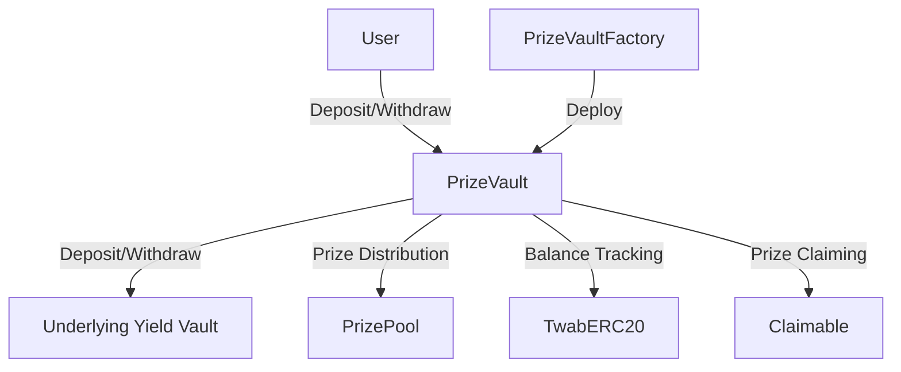

Table of Contents
---------------

1. Introduction
2. Approach
3. Architecture Overview
   3.1. PrizeVault
   3.2. PrizeVaultFactory
   3.3. Architecture Diagram
4. Codebase Quality Analysis
5. Integration logic with various yield sources and the handling of asset losses
6. Centralization Risks
   6.1. Centralization Risks
   6.2. Dependence on External Contracts
   6.3. Need for Thorough Auditing and Monitoring
7. PrizeVault owner/admin capabilities
8. Mechanism Review
   8.1. Deposit and Withdrawal
   8.2. Yield Generation
   8.3. Prize Distribution
9. Systemic Risks
10. Previously issues
11. Recommendations
12. Conclusion

## Introduction
This report presents a comprehensive analysis of the PoolTogether V5 Vault codebase, focusing on the [pt-v5-vault/src/PrizeVault.sol](https://github.com/code-423n4/2024-03-pooltogether/blob/main/pt-v5-vault/src/PrizeVault.sol) and pt-v5-vault/src/[PrizeVaultFactory.sol](https://github.com/code-423n4/2024-03-pooltogether/blob/main/pt-v5-vault/src/PrizeVaultFactory.sol) contracts. The analysis aims to evaluate the codebase quality, architecture, potential issues, and risks associated with the vault implementation.

## Approach
The following approach was taken to evaluate the PoolTogether V5 Vault codebase:

1. Code Review: A thorough review of the PrizeVault and PrizeVaultFactory contracts was conducted, examining the contract structure, dependencies, and interactions with external contracts.

2. Architecture Analysis: The overall architecture of the vault system was analyzed, considering the design patterns, modularity, and separation of concerns.

3. Mechanism Review: The key mechanisms, such as deposit, withdrawal, yield generation, and prize distribution, were reviewed to assess their correctness, security, and potential vulnerabilities.

4. Risk Assessment: Potential risks, including centralization risks, systemic risks, and external dependencies, were identified and evaluated.

5. Scenario Analysis: Various scenarios were considered to assess the behavior and resilience of the vault system under different conditions.

## Architecture Overview
The PoolTogether V5 Vault system consists of two main contracts: PrizeVault and PrizeVaultFactory.

### PrizeVault
The PrizeVault contract is an ERC4626-compatible vault that allows users to deposit assets and earn yield through an underlying yield vault. The key components of the PrizeVault contract include:

- Asset Management: The contract manages the deposited assets and interacts with the underlying yield vault for generating yield.
- TwabERC20: The contract uses the TwabERC20 contract to track time-weighted average balances of depositors for prize distribution.
- Claimable: The contract inherits from the Claimable abstract contract, which enables users to claim prizes and set prize hooks.

### PrizeVaultFactory
The PrizeVaultFactory contract is responsible for deploying new instances of the PrizeVault contract with specific configurations. It allows for the creation of multiple prize vaults with different underlying yield vaults and prize pools.

### Architecture Diagram


## Codebase Quality Analysis
The PoolTogether V5 Vault codebase demonstrates several positive qualities:

1. Modularity: The codebase is well-structured and modular, with separate contracts for different functionalities, such as the PrizeVault, TwabERC20, and Claimable contracts.

2. Inheritance and Composition: The contracts make use of inheritance and composition to reuse code and maintain a clear separation of concerns. For example, the PrizeVault contract inherits from the TwabERC20 and Claimable contracts.

3. ERC4626 Compatibility: The PrizeVault contract implements the ERC4626 standard for vault-like contracts, ensuring compatibility with other ERC4626-compliant systems.

4. Error Handling: The codebase utilizes custom errors for error handling, providing meaningful error messages and reducing gas costs compared to string-based error messages.

However, there are a few areas that could be improved:

1. Documentation: While the codebase includes some inline comments, more comprehensive documentation explaining the contract interactions, assumptions, and potential risks would be beneficial.

2. Unit Tests: The codebase would benefit from a comprehensive suite of unit tests to ensure the correctness of the implemented functionalities and to catch potential edge cases.

3. Gas Optimization: Although the codebase employs some gas optimization techniques, such as the use of custom errors, there may be opportunities for further optimization, especially in complex functions like `_depositAndMint` and `_burnAndWithdraw`.

## Integration logic with various yield sources and the handling of asset losse

1. **Yield Vault Integration**:
   The `PrizeVault` contract is designed to work with any ERC4626-compliant yield vault. The integration happens through the `yieldVault` variable, which is set in the constructor:

   ```solidity
   constructor(
       // ...
       IERC4626 yieldVault_,
       // ...
   ) {
       // ...
       yieldVault = yieldVault_;
       // ...
   }
   ```

   The integration with the yield vault is primarily handled in the following functions:

   - `_depositAndMint`: This function interacts with the yield vault's `previewDeposit`, `mint`, and `approve` functions to deposit assets and mint shares.
   - `_withdraw`: This function interacts with the yield vault's `previewWithdraw` and `redeem` functions to withdraw assets from the yield vault.
   - `_maxYieldVaultWithdraw`: This function calculates the maximum amount of assets that can be withdrawn from the yield vault by calling `yieldVault.maxRedeem` and converting the result to assets.

   It's important to thoroughly test the integration with different yield vault implementations to ensure compatibility and catch any potential issues or edge cases.

2. **Handling Asset Losses**:
   The `PrizeVault` contract is designed to handle scenarios where the underlying yield vault loses assets. This is achieved through the `convertToShares` and `convertToAssets` functions, which adjust the share-to-asset ratio based on the total assets controlled by the vault.

   ```solidity
   function convertToShares(uint256 _assets) public view returns (uint256) {
       uint256 totalDebt_ = totalDebt();
       uint256 _totalAssets = totalAssets();
       if (_totalAssets >= totalDebt_) {
           return _assets;
       } else {
           // If the vault controls less assets than what has been deposited, a share will be worth a
           // proportional amount of the total assets. This can happen due to fees, slippage, or loss
           // of funds in the underlying yield vault.
           return _assets.mulDiv(totalDebt_, _totalAssets, Math.Rounding.Down);
       }
   }

   function convertToAssets(uint256 _shares) public view returns (uint256) {
       uint256 totalDebt_ = totalDebt();
       uint256 _totalAssets = totalAssets();
       if (_totalAssets >= totalDebt_) {
           return _shares;
       } else {
           // If the vault controls less assets than what has been deposited, a share will be worth a
           // proportional amount of the total assets. This can happen due to fees, slippage, or loss
           // of funds in the underlying yield vault.
           return _shares.mulDiv(_totalAssets, totalDebt_, Math.Rounding.Down);
       }
   }
   ```

   These functions ensure that when the underlying yield vault loses assets, depositors can only withdraw a proportional amount based on their share balance and the total debt balance.

   Additionally, the `PrizeVault` contract implements a "recovery mode" when `totalAssets` is less than `totalDebt`. In this mode, new deposits and mints are prevented, liquidations cannot occur, and the `availableYieldBalance` is set to zero.

   ```solidity
   if (totalAssets() < totalDebt()) revert LossyDeposit(totalAssets(), totalDebt());
   ```

   This recovery mode ensures that the vault does not enter an unrecoverable state and maintains the integrity of the accounting system.

However, it's important to thoroughly review and test the asset loss handling mechanisms to ensure they work as intended across different yield vault implementations and edge cases. Additionally, consider the potential impact of asset losses on the overall system, such as the ability to claim prizes and the implications for the prize pool.

## Centralization Risks
The PoolTogether V5 Vault system has some centralization risks to consider:

1. Vault Owner: The PrizeVault contract has an owner role that holds significant control over the vault's configuration, such as setting the claimer, liquidation pair, yield fee percentage, and yield fee recipient. If the owner's private key is compromised or the owner acts maliciously, it could pose a risk to the vault's integrity.

2. Dependence on External Contracts: The PrizeVault contract interacts with external contracts, such as the underlying yield vault, prize pool, and TwabController. Any vulnerabilities or malicious behavior in these external contracts could impact the security and functionality of the prize vault.

To mitigate these risks, it is recommended to:
- Implement a multi-signature or decentralized governance mechanism for critical actions performed by the vault owner.
- Thoroughly audit and monitor the external contracts integrated with the prize vault to ensure their security and reliability.


**Centralization Risks:**

**Issue:** The PrizeVault contract has a single owner who holds significant control over critical functions and parameters of the vault.

**Impact:** If the owner's private key is compromised or the owner acts maliciously, they could abuse their privileges to manipulate the vault's configuration, steal funds, or disrupt the system's operation. This centralization of power poses a significant risk to the security and integrity of the prize vault.

**Root Cause:** The PrizeVault contract inherits from the `Ownable` contract, which follows a centralized ownership model. The contract constructor sets the initial owner, and the owner has exclusive access to critical functions such as `setClaimer`, `setLiquidationPair`, `setYieldFeePercentage`, and `setYieldFeeRecipient`.

**Likelihood:** The likelihood of this issue depends on the security practices and trustworthiness of the vault owner. If proper key management and access controls are not in place, the risk of the owner's private key being compromised increases. Similarly, if the owner is not properly vetted or has malicious intentions, the likelihood of abuse of power is higher.

**Scenario:** Let's consider a scenario where the owner's private key is stolen by a malicious actor. The attacker gains control over the owner's account and can now manipulate the vault's configuration. They could set a malicious claimer contract, change the liquidation pair to siphon funds, or modify the yield fee parameters to extract excessive fees. Users' funds are now at risk, and the attacker can perform unauthorized actions on behalf of the vault owner.

## [pt-v5-vault/src/PrizeVault.sol](https://github.com/code-423n4/2024-03-pooltogether/blob/main/pt-v5-vault/src/PrizeVault.sol)
```solidity
contract PrizeVault is TwabERC20, Claimable, IERC4626, ILiquidationSource, Ownable {
    // ...

    function setClaimer(address _claimer) external onlyOwner {
        _setClaimer(_claimer);
    }

    function setLiquidationPair(address _liquidationPair) external onlyOwner {
        // ...
    }

    function setYieldFeePercentage(uint32 _yieldFeePercentage) external onlyOwner {
        _setYieldFeePercentage(_yieldFeePercentage);
    }

    function setYieldFeeRecipient(address _yieldFeeRecipient) external onlyOwner {
        _setYieldFeeRecipient(_yieldFeeRecipient);
    }

    // ...
}
```

The critical functions [`setClaimer`](https://github.com/code-423n4/2024-03-pooltogether/blob/480d58b9e8611c13587f28811864aea138a0021a/pt-v5-vault/src/PrizeVault.sol#L735-L737), [`setLiquidationPair`](https://github.com/code-423n4/2024-03-pooltogether/blob/480d58b9e8611c13587f28811864aea138a0021a/pt-v5-vault/src/PrizeVault.sol#L742), [`setYieldFeePercentage`](https://github.com/code-423n4/2024-03-pooltogether/blob/480d58b9e8611c13587f28811864aea138a0021a/pt-v5-vault/src/PrizeVault.sol#L753), and [`setYieldFeeRecipient`](https://github.com/code-423n4/2024-03-pooltogether/blob/480d58b9e8611c13587f28811864aea138a0021a/pt-v5-vault/src/PrizeVault.sol#L759) are protected by the `onlyOwner` modifier, granting exclusive access to the contract owner.

**Recommendations:**
- Implement a multi-signature or decentralized governance mechanism for critical functions, requiring multiple trusted parties to approve significant changes to the vault's configuration.
- Conduct thorough background checks and security audits on the vault owner to ensure their trustworthiness and competence.
- Implement strict access controls and key management practices to minimize the risk of the owner's private key being compromised.
- Consider using a time-lock mechanism to introduce a delay between the proposal and execution of critical changes, allowing time for users to review and react to potential malicious actions.

**Dependence on External Contracts:**

**Issue:** The PrizeVault contract heavily relies on external contracts, such as the underlying yield vault, prize pool, and TwabController, for its core functionalities.

**Impact:** If any of the external contracts have vulnerabilities, bugs, or malicious behavior, it could severely impact the security and reliability of the PrizeVault. Exploits or failures in the external contracts could lead to loss of funds, incorrect accounting, or disruption of the prize vault's operation.

**Root Cause:** The PrizeVault contract is designed to integrate with external contracts to leverage their functionalities, such as yield generation (yield vault), prize distribution (prize pool), and balance tracking (TwabController). The contract assumes that these external contracts are secure, reliable, and behave as expected.

**Likelihood:** The likelihood of issues arising from external contract dependencies depends on the security and reliability of those contracts. If the external contracts have undergone thorough audits, have a proven track record, and are well-maintained, the likelihood of vulnerabilities or malicious behavior is lower. However, if the external contracts are not properly vetted or have known issues, the likelihood of problems increases.

**Scenario:** Let's consider a scenario where the underlying yield vault has a vulnerability that allows an attacker to steal funds. If the PrizeVault contract deposits a significant portion of its assets into the yield vault, and the attacker exploits the vulnerability, the PrizeVault could suffer a substantial loss of funds. Users' deposits in the PrizeVault are now at risk, and the vault may not be able to fulfill withdrawal requests or distribute prizes correctly.

**Relevant Code:**
```solidity
contract PrizeVault is TwabERC20, Claimable, IERC4626, ILiquidationSource, Ownable {
    // ...

    IERC4626 public immutable yieldVault;

    PrizePool public immutable prizePool;

    TwabController public immutable twabController;

    // ...

    function _depositAndMint(address _caller, address _receiver, uint256 _assets, uint256 _shares) internal {
        // ...
        uint256 _yieldVaultShares = yieldVault.previewDeposit(_assetsWithDust);
        uint256 _assetsUsed = yieldVault.mint(_yieldVaultShares, address(this));
        // ...
    }

    function claimPrize(
        address _winner,
        uint8 _tier,
        uint32 _prizeIndex,
        uint96 _reward,
        address _rewardRecipient
    ) external onlyClaimer returns (uint256) {
        // ...
        uint256 prizeTotal = prizePool.claimPrize(
            _winner,
            _tier,
            _prizeIndex,
            recipient,
            _reward,
            _rewardRecipient
        );
        // ...
    }

    // ...
}
```

The code snippets above highlight the PrizeVault's interactions with the yield vault (`yieldVault`), prize pool (`prizePool`), and TwabController (`twabController`). The contract relies on these external contracts for depositing assets, claiming prizes, and tracking balances.

**Recommendations:**
- Conduct thorough security audits and due diligence on the external contracts integrated with the PrizeVault to identify and address any vulnerabilities or potential risks.
- Establish clear guidelines and criteria for selecting reliable and secure external contracts, such as requiring audits, bug bounties, and a proven track record.
- Implement monitoring and alerting mechanisms to detect any suspicious activities or anomalies in the interactions with external contracts.
- Regularly review and update the external contract dependencies to ensure they are up to date and address any known issues or vulnerabilities.
- Consider implementing circuit breakers or emergency pause functionality to halt interactions with external contracts in case of detected anomalies or security incidents.

**Need for Thorough Auditing and Monitoring:**

**Issue:** The complex nature of the PoolTogether V5 Vault system and its interactions with external contracts necessitate thorough auditing and continuous monitoring to ensure its security and reliability.

**Impact:** Without comprehensive audits and ongoing monitoring, vulnerabilities, bugs, or exploits in the PrizeVault contract or its dependent contracts may go undetected. This could lead to financial losses for users, reputational damage for the PoolTogether protocol, and erosion of trust in the system.

**Root Cause:** The PoolTogether V5 Vault system is a complex ecosystem involving multiple contracts, external dependencies, and intricate interactions. The codebase may contain subtle bugs, edge cases, or design flaws that are not immediately apparent. Moreover, the evolving nature of the blockchain and DeFi landscape means that new threats and vulnerabilities may emerge over time.

**Likelihood:** The likelihood of issues stemming from inadequate auditing and monitoring is relatively high, given the complexity of the system and the potential for human error in the development process. Smart contracts are prone to vulnerabilities, and even well-audited contracts may have undiscovered issues.

**Scenario:** Let's consider a scenario where a critical vulnerability is discovered in the PrizeVault contract post-deployment. If the vulnerability is not promptly identified and addressed through continuous monitoring and auditing, attackers may exploit it to drain funds from the vault or manipulate the prize distribution. Users' assets are now at risk, and the reputation of the PoolTogether protocol is severely damaged.

**Relevant Code:**
The need for thorough auditing and monitoring applies to the entire PoolTogether V5 Vault codebase, including the PrizeVault, PrizeVaultFactory, and all the dependent contracts. It is crucial to review and audit not only the individual contracts but also their interactions and the overall system architecture.

**Recommendations:**
- Engage reputable security auditing firms to conduct comprehensive audits of the PoolTogether V5 Vault codebase, including the PrizeVault, PrizeVaultFactory, and all dependent contracts.
- Establish a bug bounty program to incentivize the community to identify and report vulnerabilities or potential exploits.
- Implement a robust monitoring and alerting system to continuously monitor the vault's operations, detect anomalies, and trigger alerts for suspicious activities.
- Regularly review and update the codebase to address any identified issues, incorporate best practices, and keep up with the latest security standards.
- Foster a culture of transparency and open communication with the community, promptly disclosing any discovered vulnerabilities and the measures taken to address them.
- Conduct periodic security assessments and penetration testing to proactively identify and mitigate potential threats.
- Maintain a comprehensive risk management framework, including incident response plans and contingency measures, to swiftly respond to and recover from security incidents.

By addressing the centralization risks, carefully managing dependencies on external contracts, and implementing thorough auditing and monitoring practices, the PoolTogether V5 Vault system can significantly enhance its security, reliability, and resilience. However, it is important to acknowledge that no system is completely risk-free, and continuous vigilance and improvement are necessary to stay ahead of evolving threats in the dynamic world of blockchain and decentralized finance.

## PrizeVault owner/admin capabilities

1. `setClaimer(address _claimer)` - Allows owner to change the vault's associated claimer contract.

2. `setLiquidationPair(address _liquidationPair)` - Allows owner to change the liquidation pair contract used for yield harvesting.

3. `setYieldFeePercentage(uint32 _yieldFeePercentage)` - Allows owner to adjust the percentage of harvested yield taken as a fee. Capped at `MAX_YIELD_FEE`.

4. `setYieldFeeRecipient(address _yieldFeeRecipient)` - Allows owner to change the address that receives yield fee payouts.

Access Control Review:
- All these privileged functions have the `onlyOwner` modifier, which is good. They can only be called by the owner account.
- The owner is set in the constructor and can't be changed afterwards. There's no function to transfer ownership.
- There's no timelock on any of these actions. An owner can make changes instantly.

Backdoor Risks:
- The `onlyOwner` modifier and `Ownable` contract look standard, using msg.sender for authentication. No obvious backdoors there.
- The `onlyOwner` functions themselves don't have any alternate caller checks or ways to bypass.
- However, if the owner private key is compromised, the attacker would have full power over the vault. There's no multisig or delayed ownership transfer.

Privilege Escalation Scenarios:

1. Malicious claimer:
- If an owner is tricked into calling `setClaimer()` with a malicious claimer contract, that claimer would be able to hijack all prize payouts from the vault.
- Potential attack: Claimer contract claims prizes but never actually sends them to the rightful winners, instead keeping them for itself.

2. Malicious liquidation pair:
- If the owner sets a malicious/vulnerable liquidation pair with `setLiquidationPair()`, harvested yield could be stolen before reaching the prize pool.
- Potential attack: Attacker gets owner to set a liquidator that sends all yield to attacker's address instead of the prize pool.

3. Excessive fees:
- An owner could set an unfairly high `yieldFeePercentage`, siphoning off most yield before it reaches the prize pool.
- While `setYieldFeePercentage()` is capped at `MAX_YIELD_FEE`, this constant should be reviewed to ensure it's a reasonable maximum.

4. Fee recipient hijacking:
- If an owner is tricked into setting the fee recipient to an attacker's address with `setYieldFeeRecipient()`, the attacker would receive all future fee payouts.

Mitigations:
- Use a multisig wallet as the owner to prevent single point of compromise.
- Implement timelocks on sensitive owner actions. For example, claimer/liquidator changes only take effect after a delay period.
- Extensively audit new claimer, liquidator, fee recipient contracts before allowing the owner to set them.
- Clearly document the risks of each owner privilege and implement strict internal controls around their use.
- Consider implementing a DAO or community governance mechanism for high-impact changes like fee adjustments.

Overall, the owner privileges are quite powerful and could cause serious issues if misused or hijacked. While the basic `onlyOwner` access control is in place, there's room for improvement in terms of timelocks, multisig, and safe owner transfer mechanisms.

I recommend a thorough internal review of each owner capability and implementing stricter controls/oversight around their use. Simulating some "rogue owner" scenarios and checking that failsafes trigger would also be valuable.

## Mechanism Review
The key mechanisms of the PoolTogether V5 Vault system were reviewed for correctness, security, and potential vulnerabilities:

### Deposit and Withdrawal
The deposit and withdrawal mechanisms in the PrizeVault contract are implemented using the ERC4626 standard functions, such as `deposit`, `mint`, `withdraw`, and `redeem`. The contract correctly updates the user balances, mints or burns shares, and interacts with the underlying yield vault for asset management.

However, there are a few potential issues to consider:
- The contract does not have explicit reentrancy guards for the deposit and withdrawal functions. While the current implementation mitigates reentrancy risks by updating the contract state before external calls, it is recommended to add explicit reentrancy guards for added security.
- The deposit and withdrawal mechanisms rely on the correct implementation and behavior of the underlying yield vault. Any issues or vulnerabilities in the yield vault could impact the correctness and security of the deposit and withdrawal processes.

### Yield Generation
The PrizeVault contract generates yield by depositing assets into an underlying yield vault. The contract assumes that the yield vault implements the ERC4626 standard correctly and generates yield as expected.

However, there are risks associated with the yield generation mechanism:
- If the underlying yield vault experiences a loss of funds or fails to generate the expected yield, it could impact the ability of the PrizeVault to fulfill withdrawals and prize distributions.
- The PrizeVault contract does not have explicit checks or safeguards against malicious or faulty yield vaults. It relies on the trust and correct implementation of the yield vault.

To mitigate these risks, it is crucial to:
- Carefully select and audit the underlying yield vaults to ensure their security, reliability, and correct implementation of the ERC4626 standard.
- Implement monitoring and risk management mechanisms to detect and respond to any issues or anomalies in the yield generation process.

### Prize Distribution
The PrizeVault contract integrates with the PrizePool contract for prize distribution. Users can claim prizes through the `claimPrize` function, which triggers the prize hooks set by the winners.

The prize distribution mechanism has the following considerations:
- The `claimPrize` function does not have explicit access control, allowing any address to claim prizes on behalf of the winners. While this is intended behavior, it is important to ensure that the prize distribution logic in the PrizePool contract is secure and cannot be exploited by malicious actors.
- The prize hooks allow winners to execute arbitrary logic during the prize claiming process. While the hooks are called with a fixed gas limit to prevent excessive gas consumption, it is important to carefully review and audit the hook implementations to prevent potential vulnerabilities or exploits.

To ensure the security of the prize distribution mechanism, it is recommended to:
- Thoroughly audit the PrizePool contract and its integration with the PrizeVault to identify and address any potential vulnerabilities or exploits.
- Provide clear guidelines and best practices for implementing secure and reliable prize hooks.
- Implement monitoring and emergency controls to detect and respond to any suspicious or malicious behavior during the prize claiming process.

## Systemic Risks
The PoolTogether V5 Vault system is exposed to several systemic risks:

1. Economic Risks: The value of the deposited assets and the generated yield are subject to market fluctuations and economic conditions. Adverse market events or shifts in the underlying asset prices could impact the stability and value of the prize vaults.

2. Regulatory Risks: The regulatory landscape for cryptocurrency and decentralized finance (DeFi) is evolving, and changes in regulations or legal requirements could impact the operations and viability of the PoolTogether V5 Vault system.

3. Technological Risks: The PoolTogether V5 Vault system relies on the security and reliability of the underlying blockchain infrastructure, smart contracts, and external dependencies. Any vulnerabilities, bugs, or failures in these components could pose risks to the system's integrity and user funds.

To mitigate these systemic risks, it is important to:
- Continuously monitor and assess the economic, regulatory, and technological landscape to identify and adapt to potential risks.
- Maintain a robust risk management framework, including contingency plans and emergency response procedures, to address adverse events or failures.
- Foster transparency and regular communication with users and stakeholders to build trust and manage expectations.


## Previously issues

1. Forceful deposit through `depositWithPermit`:
   - In the previous version, there was a vulnerability in the `depositWithPermit` function that allowed anyone to force a deposit on behalf of another user without their permission.
   - The vulnerability was caused by the lack of proper validation of the `_owner` parameter. The function only checked that the `permit` signature was valid, but it didn't ensure that the signer of the permit was the same as the `_owner` specified in the function call.
   - This allowed an attacker to create a valid permit signature for a certain amount of assets, and then call `depositWithPermit` with an arbitrary `_owner` address, effectively forcing a deposit on behalf of that user.

   The new version of [`depositWithPermit`](https://github.com/code-423n4/2024-03-pooltogether/blob/480d58b9e8611c13587f28811864aea138a0021a/pt-v5-vault/src/PrizeVault.sol#L524-L546)

   ```solidity
   function depositWithPermit(
       uint256 _assets,
       address _owner,
       uint256 _deadline,
       uint8 _v,
       bytes32 _r,
       bytes32 _s
   ) external returns (uint256) {
       if (_owner != msg.sender) {
           revert PermitCallerNotOwner(msg.sender, _owner);
       }
       // ...
   }
   ```

   - In the new version, the `depositWithPermit` function includes an explicit check to ensure that the `_owner` address matches the `msg.sender`.
   - If the `_owner` address doesn't match the caller of the function (`msg.sender`), the function reverts with a `PermitCallerNotOwner` error.
   - This check prevents the forceful deposit vulnerability, as an attacker can no longer specify an arbitrary `_owner` address. The function will only allow the owner of the assets to make the deposit.

   Therefore, the forceful deposit vulnerability has been appropriately addressed in the new version of the PrizeVault contract.

2. Miscalculation of `totalAssets` in vaults using Aave V3:
   - In a previous integration with Aave V3, there was an issue with the calculation of `totalAssets` in the PrizeVault contract.
   - The issue arose because Aave V3 uses a non-standard implementation of the `totalAssets` function, which returns the total assets minus any accrued debt.
   - This caused a miscalculation in the PrizeVault contract, as it relied on the standard ERC4626 behavior where `totalAssets` represents the total underlying assets controlled by the vault.

   The new version of [totalAssets](https://github.com/code-423n4/2024-03-pooltogether/blob/480d58b9e8611c13587f28811864aea138a0021a/pt-v5-vault/src/PrizeVault.sol#L336-L338)

   ```solidity
   function totalAssets() public view returns (uint256) {
       return yieldVault.convertToAssets(yieldVault.balanceOf(address(this))) + _asset.balanceOf(address(this));
   }
   ```

   - In the new version, the `totalAssets` function calculates the total assets by querying the balance of the PrizeVault in the underlying yield vault (`yieldVault`) and converting it to the corresponding amount of assets using `convertToAssets`.
   - It also adds any leftover assets that are held directly by the PrizeVault (`_asset.balanceOf(address(this))`).
   - This calculation assumes that the underlying yield vault (`yieldVault`) implements the standard ERC4626 `convertToAssets` function correctly, which converts a given amount of vault shares to the corresponding amount of underlying assets.

   If the Aave V3 vault is used as the yield vault, the miscalculation issue would still persist if Aave V3 doesn't implement the `convertToAssets` function according to the ERC4626 standard.

   To ensure compatibility with Aave V3 or any other yield vault that deviates from the standard, additional checks and adjustments may be needed in the PrizeVault contract. For example:
   - The PrizeVault could include specific logic to handle the Aave V3 case, taking into account its non-standard `totalAssets` implementation.
   - The PrizeVault could perform additional validation on the yield vault's `convertToAssets` function to ensure it returns the expected value.
   - If the yield vault's implementation cannot be trusted, the PrizeVault may need to calculate the total assets independently based on its own accounting and the yield vault's reported share balance.

   > The new version of the PrizeVault contract doesn't specifically address the miscalculation issue with Aave V3, as it assumes that the yield vault follows the standard ERC4626 implementation. To fully resolve this issue, additional checks and handling specific to Aave V3 (or any other non-standard yield vault) may be required.

### Recommendations
1. Thoroughly test the `depositWithPermit` function to ensure that it correctly prevents forceful deposits and only allows the owner of the assets to make the deposit.
2. When integrating with Aave V3 or any other yield vault that deviates from the ERC4626 standard, carefully review and test the compatibility of the PrizeVault contract with the yield vault's specific implementation.
3. Consider implementing additional checks and error handling in the PrizeVault contract to detect and handle cases where the yield vault's behavior doesn't align with the expected ERC4626 standard.
4. Monitor the integrated yield vaults for any changes or updates that could impact the compatibility with the PrizeVault contract, and make necessary adjustments to ensure accurate calculation of total assets and other critical values.

> While the forceful deposit vulnerability has been addressed in the new version, the miscalculation issue with Aave V3 (or other non-standard yield vaults) may still require additional handling and testing to ensure full compatibility and correct behavior.


## Conclusion
The PoolTogether V5 Vault system, as implemented in the PrizeVault and PrizeVaultFactory contracts, provides a robust and flexible framework for creating prize-linked savings accounts. The codebase demonstrates good practices in terms of modularity, inheritance, and compatibility with the ERC4626 standard.

However, there are certain risks and potential issues to consider, such as centralization risks, dependence on external contracts, and the need for thorough auditing and monitoring of the integrated components.

To enhance the security and reliability of the PoolTogether V5 Vault system, it is recommended to address the identified issues, implement additional safeguards and risk management mechanisms, and conduct regular audits and security assessments.

By carefully managing the risks and continuously improving the codebase, the PoolTogether V5 Vault system can provide a secure and attractive platform for users to save and earn prizes while supporting the growth and adoption of decentralized finance.


### Time spent:
39 hours