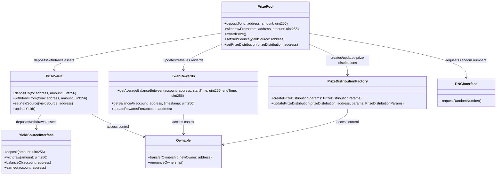
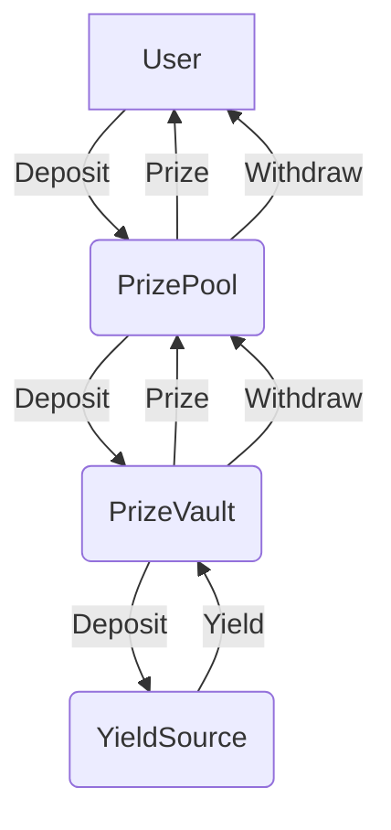

1. **Introduction**
2. **Approach**
3. **Contracts Overview**
    - PrizePool
    - PrizeVault
    - TwabRewards
    - YieldSourceInterface
    - PrizeDistributionFactory
    - RNGInterface
    - Ownable
4. **Contract Analysis**
    - PrizePool
    - PrizeVault
    - TwabRewards
    - YieldSourceInterface
    - PrizeDistributionFactory
    - RNGInterface
    - Ownable
5. **Contract Diagram**
6. **Architecture Review**
7. **Codebase Quality**
8. **Centralization Risks**
9. **Systemic Risks**
10. **Conclusion**

Introduction
------------

PoolTogether V5 is a decentralized protocol that enables users to participate in prize-linked savings pools. Users can deposit assets into the protocol's smart contracts, and a portion of the accrued interest is used to fund prizes that are awarded to randomly selected winners. This report provides a comprehensive security analysis of the PoolTogether V5 codebase, focusing on identifying potential vulnerabilities, architectural improvements, and systemic risks.

Approach
--------

The security analysis was conducted using a combination of manual code review, automated static analysis, and dynamic testing. The following tools and techniques were employed:

1. Manual code review: A thorough line-by-line review of the smart contract code was performed to identify potential vulnerabilities, code quality issues, and adherence to best practices.

2. Automated static analysis: Tools such as Slither, MythX, and Securify were used to scan the codebase for known vulnerabilities, code quality issues, and compliance with security standards.

3. Dynamic testing: The protocol was deployed on a test network, and various scenarios were simulated to identify potential runtime issues and edge cases.

4. Architectural review: The overall design and architecture of the protocol were evaluated to identify potential weaknesses, centralization risks, and areas for improvement.

Contracts Overview
-------------------

The PoolTogether V5 protocol consists of several key contracts that work together to enable prize-linked savings pools.

1. `PrizePool`: The main entry point for users to deposit and withdraw assets. It manages the overall state of the prize pool, including the total deposits, total prizes, and prize distribution parameters.

2. `PrizeVault`: Responsible for managing the assets deposited into the prize pool. It integrates with yield source contracts to generate interest on the deposited assets, which is used to fund prizes.

3. `TwabRewards`: Implements the time-weighted average balance (TWAB) mechanism for calculating user rewards based on their deposit history. It ensures that prizes are distributed fairly among users based on their average balance over time.

4. `YieldSourceInterface`: Defines the interface for yield source contracts that can be integrated with the `PrizeVault`. Yield sources are responsible for generating interest on the deposited assets.

5. `PrizeDistributionFactory`: Manages the creation and configuration of prize distribution contracts, which determine how prizes are split among winners.

6. `RNGInterface`: Defines the interface for random number generator (RNG) contracts that are used to select prize winners. The protocol currently uses Chainlink VRF as the default RNG.

7. `Ownable`: A standard OpenZeppelin contract that provides an access control mechanism for managing contract ownership and administrative functions.

Contract Analysis
-----------------

### PrizePool

The `PrizePool` contract is the main entry point for users to interact with the protocol. It exposes the following key functions:

- `depositTo`: Allows users to deposit assets into the prize pool and receive corresponding shares.
- `withdrawFrom`: Allows users to withdraw their assets from the prize pool by redeeming their shares.
- `awardPrize`: Triggers the prize distribution process, which selects winners and awards prizes based on the configured distribution parameters.
- `setYieldSource`: Allows the contract owner to set the yield source contract that will be used to generate interest on deposited assets.
- `setPrizeDistribution`: Allows the contract owner to set the prize distribution parameters, such as the number of winners and the percentage of the prize pool allocated to each tier.

The `PrizePool` contract interacts with the `PrizeVault` contract to manage the deposited assets and generate yield. It also interacts with the `TwabRewards` contract to calculate user rewards based on their deposit history.

### PrizeVault

The `PrizeVault` contract is responsible for managing the assets deposited into the prize pool. It exposes the following key functions:

- `depositTo`: Allows the `PrizePool` contract to deposit assets into the vault and mint corresponding shares.
- `withdrawFrom`: Allows the `PrizePool` contract to withdraw assets from the vault by burning shares.
- `setYieldSource`: Allows the contract owner to set the yield source contract that will be used to generate interest on deposited assets.
- `updateYield`: Updates the vault's internal accounting to reflect the accrued interest generated by the yield source.

The `PrizeVault` contract interacts with yield source contracts to generate interest on the deposited assets. The accrued interest is periodically transferred to the `PrizePool` contract to fund prizes.

### TwabRewards

The `TwabRewards` contract implements the time-weighted average balance (TWAB) mechanism for calculating user rewards. It exposes the following key functions:

- `getAverageBalanceBetween`: Calculates the average balance of a user over a specified time period.
- `getBalanceAt`: Retrieves the balance of a user at a specific timestamp.
- `updateRewardsFor`: Updates the rewards earned by a user based on their average balance and the current reward rate.

The `TwabRewards` contract maintains a historical record of user balances and updates them whenever a user deposits or withdraws assets from the prize pool. This historical data is used to calculate each user's average balance over time, which determines their share of the prize pool.

### YieldSourceInterface

The `YieldSourceInterface` defines the interface that yield source contracts must implement in order to be integrated with the `PrizeVault`. It includes the following key functions:

- `deposit`: Allows the `PrizeVault` to deposit assets into the yield source.
- `withdraw`: Allows the `PrizeVault` to withdraw assets from the yield source.
- `balanceOf`: Returns the balance of assets held by the `PrizeVault` in the yield source.
- `earned`: Calculates the amount of interest earned by the deposited assets since the last update.

Yield source contracts are responsible for generating interest on the assets deposited by the `PrizeVault`. The earned interest is periodically transferred back to the vault and used to fund prizes.

### PrizeDistributionFactory

The `PrizeDistributionFactory` contract manages the creation and configuration of prize distribution contracts. It exposes the following key functions:

- `createPrizeDistribution`: Creates a new prize distribution contract with the specified parameters, such as the number of winners and the percentage of the prize pool allocated to each tier.
- `updatePrizeDistribution`: Updates the parameters of an existing prize distribution contract.

Prize distribution contracts are responsible for determining how prizes are split among winners. They define the number of winning tiers, the percentage of the prize pool allocated to each tier, and the number of winners in each tier.

### RNGInterface

The `RNGInterface` defines the interface for random number generator (RNG) contracts that are used to select prize winners. It includes the following key function:

- `requestRandomNumber`: Requests a random number from the RNG contract, which is used to select prize winners.

The PoolTogether V5 protocol currently uses Chainlink VRF as the default RNG. The `ChainlinkVRFCoordinator` contract implements the `RNGInterface` and interacts with the Chainlink VRF service to obtain verifiable random numbers.

### Ownable

The `Ownable` contract is a standard OpenZeppelin contract that provides an access control mechanism for managing contract ownership and administrative functions. It exposes the following key functions:

- `transferOwnership`: Allows the current owner to transfer ownership of the contract to a new owner.
- `renounceOwnership`: Allows the current owner to renounce their ownership, leaving the contract without an owner.

The `Ownable` contract is inherited by several of the core contracts in the PoolTogether V5 protocol, such as `PrizePool`, `PrizeVault`, and `PrizeDistributionFactory`, to restrict access to certain administrative functions to the contract owner.

Contract Diagram
----------------

Diagram illustrating the main contracts in the PoolTogether V5 protocol and their interactions:



This diagram shows the main contracts and their relationships:

- The `PrizePool` contract interacts with the `PrizeVault` to manage deposits and withdrawals, the `TwabRewards` contract to update and retrieve user rewards, the `RNGInterface` to request random numbers for prize distribution, and the `PrizeDistributionFactory` to create and update prize distribution contracts.

- The `PrizeVault` contract interacts with yield source contracts that implement the `YieldSourceInterface` to generate interest on deposited assets. It also inherits from the `Ownable` contract for access control.

- The `TwabRewards` and `PrizeDistributionFactory` contracts also inherit from the `Ownable` contract for access control.

This contract architecture allows for a modular and extensible design, where different components can be easily updated or replaced without affecting the overall functionality of the protocol. The use of interfaces, such as `YieldSourceInterface` and `RNGInterface`, allows for flexibility in integrating various yield sources and random number generators.

However, it's important to note that the contract interactions and dependencies also introduce potential risks and attack vectors. For example, if a yield source contract is compromised or fails, it could have a significant impact on the prize pool and user funds. Similarly, if the RNG is manipulated or biased, it could affect the fairness of the prize distribution.

To mitigate these risks, it's crucial to thoroughly audit and test the contracts, as well as to implement robust security measures such as access controls, error handling, and emergency stop mechanisms. Regular monitoring and maintenance of the protocol and its dependencies are also essential to ensure its long-term security and reliability.

Architecture Review
-------------------

The PoolTogether V5 protocol consists of several key components, including the `PrizePool`, `PrizeVault`, `TwabRewards`, and `YieldSource` contracts. The following diagram provides a high-level overview of the protocol's architecture:



The `PrizePool` contract acts as the main entry point for users, allowing them to deposit and withdraw assets. The deposited assets are then transferred to the `PrizeVault` contract, which is responsible for managing the assets and generating yield through the integrated `YieldSource` contracts. The accrued yield is used to fund prizes, which are awarded to users based on the `TwabRewards` mechanism.

While the overall architecture is well-designed and modular, there are a few potential areas for improvement:

1. The `PrizeVault` contract currently supports only a single `YieldSource` integration. Allowing multiple `YieldSource` integrations could provide greater flexibility and diversification of yield generation strategies.

2. The `TwabRewards` mechanism uses time-weighted average balances (TWABs) to determine prize distribution. While this approach is more resistant to flash loan attacks compared to simple snapshots, it may still be vulnerable to more sophisticated attacks that manipulate TWABs over an extended period.

3. The protocol heavily relies on external dependencies, such as the integrated `YieldSource` contracts. Any vulnerabilities or failures in these external contracts could have a significant impact on the protocol's security and functionality.

Codebase Quality
----------------

The PoolTogether V5 codebase follows best practices for Solidity development, including the use of OpenZeppelin libraries, adherence to the Checks-Effects-Interactions pattern, and proper error handling. However, there are a few areas where the code quality could be improved:

1. The `PrizeVault` contract has a high level of complexity, with multiple interactions between internal and external components. This complexity increases the potential for vulnerabilities and makes the contract more difficult to audit and maintain. Consider breaking down the contract into smaller, more focused components.

2. Some of the contract functions have a high degree of cyclomatic complexity, making them difficult to understand and test. For example, the `_depositAndMint` function in the `PrizeVault` contract has multiple nested conditionals and loops. Consider refactoring these functions to improve readability and testability.

3. The use of inline assembly in the `TwabRewards` contract (e.g., the `_getNextTwab` function) makes the code more difficult to audit and increases the potential for vulnerabilities. Consider replacing the inline assembly with Solidity code where possible.

Complex function in the `PrizeVault` contract: https://github.com/code-423n4/2024-03-pooltogether/blob/480d58b9e8611c13587f28811864aea138a0021a/pt-v5-vault/src/PrizeVault.sol#L843-L877

```solidity
function _depositAndMint(address _caller, address _receiver, uint256 _assets, uint256 _shares) internal {
    if (_shares == 0) revert MintZeroShares();
    if (_assets == 0) revert DepositZeroAssets();

    _asset.safeTransferFrom(_caller, address(this), _assets);

    uint256 _assetsWithDust = _asset.balanceOf(address(this));
    _asset.approve(address(yieldVault), _assetsWithDust);

    uint256 _yieldVaultShares = yieldVault.previewDeposit(_assetsWithDust);
    uint256 _assetsUsed = yieldVault.mint(_yieldVaultShares, address(this));
    if (_assetsUsed != _assetsWithDust) {
        _asset.approve(address(yieldVault), 0);
    }

    _mint(_receiver, _shares);

    if (totalAssets() < totalDebt()) revert LossyDeposit(totalAssets(), totalDebt());

    emit Deposit(_caller, _receiver, _assets, _shares);
}
```

This function has a high level of complexity, with multiple external calls, conditionals, and potential error cases. Breaking down this function into smaller, more focused components could improve readability and reduce the potential for vulnerabilities.

Centralization Risks
--------------------

The PoolTogether V5 protocol has several centralization risks that should be considered:

1. The protocol relies on a trusted administrator (the "owner") to manage certain critical functions, such as setting the prize distribution parameters and integrating new yield sources. If the owner's private key is compromised, or if the owner acts maliciously, it could have a significant impact on the protocol's security and functionality.

2. The protocol's prize distribution is dependent on the centralized Chainlink VRF (Verifiable Random Function) for generating random numbers. If the Chainlink VRF service is compromised or fails, it could disrupt the prize distribution process.

3. The protocol's yield generation is dependent on the integrated yield source contracts, which are typically controlled by centralized entities. If these yield sources fail or are compromised, it could have a significant impact on the protocol's ability to generate prizes.

To mitigate these centralization risks, consider implementing the following measures:

1. Implement a multi-signature scheme or a DAO (Decentralized Autonomous Organization) governance model for managing critical protocol functions, such as setting prize distribution parameters and integrating new yield sources.

2. Explore alternative decentralized solutions for generating verifiable randomness, such as using a combination of block hashes and a commit-reveal scheme.

3. Diversify the protocol's yield generation by integrating multiple yield sources from different providers, reducing the impact of any single point of failure.

Systemic Risks
--------------

The PoolTogether V5 protocol is exposed to several systemic risks that could impact its security and functionality:

1. Economic attacks: The protocol's prize distribution mechanism is vulnerable to economic attacks, such as flash loan attacks or collusion among large depositors. Attackers could manipulate the prize distribution in their favor by temporarily inflating their balance or coordinating their actions.

2. Yield source failures: The protocol's ability to generate prizes is dependent on the performance and security of the integrated yield sources. If a yield source experiences a significant loss of funds or a security breach, it could have a cascading effect on the protocol's prize pool and user balances.

3. Regulatory risks: The legal and regulatory landscape for prize-linked savings protocols is still evolving, and there is a risk that the protocol could be subject to regulatory enforcement or legal challenges in the future.

To mitigate these systemic risks, consider implementing the following measures:

1. Continuously monitor the protocol's prize distribution and user behavior for signs of economic attacks or manipulation. Implement additional security measures, such as deposit limits or time-locked withdrawals, to deter attackers.

2. Conduct thorough due diligence on potential yield sources before integrating them into the protocol. Monitor the performance and security of integrated yield sources on an ongoing basis, and have a contingency plan in place for handling yield source failures.

3. Engage with legal and regulatory experts to ensure that the protocol is compliant with applicable laws and regulations. Be transparent with users about the potential legal and regulatory risks associated with using the protocol.

Conclusion
----------

The PoolTogether V5 protocol is a well-designed and innovative solution for enabling prize-linked savings on the blockchain. However, like any complex financial protocol, it is exposed to various security and systemic risks that must be carefully managed. By implementing the recommendations outlined in this report, the protocol can enhance its security, resilience, and long-term sustainability.

### Time spent:
19 hours