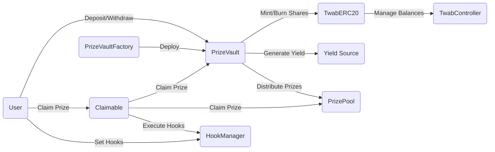

## Table of Contents

1. [Introduction](#introduction)
2. [Approach](#approach)
3. [Architecture Overview](#architecture-overview)
   - [PrizeVault](#prizevault)
   - [TwabERC20](#twaberc20)
   - [Claimable](#claimable)
   - [HookManager](#hookmanager)
   - [PrizeVaultFactory](#prizevaultfactory)
4. [Codebase Quality Analysis](#codebase-quality-analysis)
   - [Code Structure and Readability](#code-structure-and-readability)
   - [Use of Libraries and Standards](#use-of-libraries-and-standards)
   - [Testing and Coverage](#testing-and-coverage)
5. [Mechanism Review](#mechanism-review)
   - [Deposit and Withdrawal](#deposit-and-withdrawal)
   - [Yield Management](#yield-management)
   - [Prize Distribution](#prize-distribution)
   - [Hooks and Claimable Prizes](#hooks-and-claimable-prizes)
6. [Potential Issues and Risks](#potential-issues-and-risks)
   - [ERC4626 and ERC20 Compliance](#erc4626-and-erc20-compliance)
   - [Trusted Roles and Centralization](#trusted-roles-and-centralization)
   - [Yield Source Integration](#yield-source-integration)
   - [Timing Attacks and Manipulation](#timing-attacks-and-manipulation)
   - [Flash Loan Attacks](#flash-loan-attacks)
   - [MEV Risks](#mev-risks)
7. [Recommendations](#recommendations)
   - [Architecture Recommendations](#architecture-recommendations)
   - [Mitigation Strategies](#mitigation-strategies)
8. [Conclusion](#conclusion)

## Introduction <a name="introduction"></a>

This report provides an in-depth analysis of the PoolTogether V5 Vault contracts, focusing on the architecture, codebase quality, potential issues, and risks. The primary contracts under review are `PrizeVault`, `TwabERC20`, `Claimable`, `HookManager`, and `PrizeVaultFactory`.

## Approach <a name="approach"></a>

The analysis was conducted using a combination of manual code review, automated tools, and scenario-based testing. The following steps were taken:

1. Review of the contract architecture and dependencies
2. Analysis of the codebase quality, including structure, readability, and use of libraries
3. Examination of the core mechanisms, such as deposit, withdrawal, yield management, and prize distribution
4. Identification of potential issues and risks, including compliance, centralization, integration, and attack vectors
5. Provide recommendations for improvements and mitigation strategies

## Contracts Overview

1. `PrizeVault`: The core vault contract that manages user deposits, yield generation, and prize distribution. It implements the ERC4626 standard for tokenized vaults.

2. `TwabERC20`: An ERC20-compliant token contract that represents shares in the `PrizeVault`. It uses a `TwabController` to manage time-weighted average balances for each user.

3. `Claimable`: An abstract contract that provides an interface for users to claim prizes they have won. It integrates with the `PrizeVault` and `PrizePool` contracts.

4. `HookManager`: A contract that allows users to set and manage hooks that are called when they win a prize. These hooks can be used to automate actions or integrate with external systems.

5. `PrizeVaultFactory`: A factory contract used to deploy new instances of the `PrizeVault` contract with a specified yield source and prize pool.

## Contract Analysis

### PrizeVault

The `PrizeVault` contract is the central component of the system. It is responsible for managing user deposits, generating yield, and distributing prizes. The contract implements the ERC4626 standard, which defines a standardized interface for tokenized vaults.

Key components of the `PrizeVault` contract include:

- `deposit` and `withdraw` functions for users to add and remove funds from the vault.
- `mint` and `redeem` functions for minting and burning vault shares.
- `totalAssets` function to calculate the total underlying assets controlled by the vault.
- `convertToShares` and `convertToAssets` functions for converting between vault shares and underlying assets.
- Integration with an external yield source to generate yield on deposited funds.
- Distribution of yield as prizes to eligible users through a `PrizePool` contract.
- Claimable prizes functionality through the `Claimable` abstract contract.

The PrizeVault contract handles asset loss from the underlying yield vaults through a recovery mode mechanism. In this mode, several safeguards and restrictions are put in place to protect users' funds and ensure fair distribution of the remaining assets.
-------------------------------------------------------------------------------------

1. **Recovery Mode Trigger**: The recovery mode is triggered when the total assets controlled by the vault (`totalAssets()`) are less than the total debt owed to depositors (`totalDebt()`). This situation can arise due to asset loss in the underlying yield vault.

2. **Deposit and Mint Restrictions**: In recovery mode, no new deposits or mints are allowed. This is enforced by the `maxDeposit` and `maxMint` functions, which return zero if the total assets are less than the total debt. https://github.com/code-423n4/2024-03-pooltogether/blob/480d58b9e8611c13587f28811864aea138a0021a/pt-v5-vault/src/PrizeVault.sol#L374-L392

```solidity
    function maxDeposit(address) public view returns (uint256) {
        uint256 _totalSupply = totalSupply();
        uint256 totalDebt_ = _totalDebt(_totalSupply);
        if (totalAssets() < totalDebt_) return 0;


        // the vault will never mint more than 1 share per asset, so no need to convert supply limit to assets
        uint256 twabSupplyLimit_ = _twabSupplyLimit(_totalSupply);
        uint256 _maxDeposit;
        uint256 _latentBalance = _asset.balanceOf(address(this));
        uint256 _maxYieldVaultDeposit = yieldVault.maxDeposit(address(this));
        if (_latentBalance >= _maxYieldVaultDeposit) {
            return 0;
        } else {
            unchecked {
                _maxDeposit = _maxYieldVaultDeposit - _latentBalance;
            }
            return twabSupplyLimit_ < _maxDeposit ? twabSupplyLimit_ : _maxDeposit;
        }
    }
```

3. **Liquidation Restrictions**: In recovery mode, no liquidations can occur since the `availableYieldBalance` and `liquidatableBalanceOf` functions will return zero when the total assets are less than the total debt.

```solidity
function availableYieldBalance() public view returns (uint256) {
    uint256 totalDebt_ = totalDebt();
    if (totalAssets() < totalDebt_) {
        return 0;
    }
    // ...
}
```

4. **Proportional Asset Distribution**: When withdrawing or redeeming shares in recovery mode, users will receive a proportional amount of the remaining assets based on their share balance. This is handled by the `convertToAssets` function, which scales down the user's share balance according to the ratio of total assets to total debt.

https://github.com/code-423n4/2024-03-pooltogether/blob/480d58b9e8611c13587f28811864aea138a0021a/pt-v5-vault/src/PrizeVault.sol#L355-L366
```solidity
function convertToAssets(uint256 _shares) public view returns (uint256) {
    uint256 totalDebt_ = totalDebt();
    uint256 _totalAssets = totalAssets();
    if (_totalAssets >= totalDebt_) {
        return _shares;
    } else {
        // If the vault controls less assets than what has been deposited, a share will be worth a
        // proportional amount of the total assets.
        return _shares.mulDiv(_totalAssets, totalDebt_, Math.Rounding.Down);
    }
}
```

5. **Invariants in Recovery Mode**: In recovery mode, the following invariants should hold true:
   - `availableYieldBalance()` == `0`
   - `liquidatableBalanceOf(...)` == `0`
   - `totalAssets()` == `convertToAssets(totalDebt())` (up to 1 unit rounding error is acceptable)

Potential points of failure or edge cases that could break the integration with yield sources:
----------------------------------------------------------------------------------------------

1. **Yield Source Vulnerability or Exploit**: If the underlying yield source is compromised or exploited, leading to a significant loss of assets, the PrizeVault may enter recovery mode. In such cases, it's essential to thoroughly audit and review the yield source's security to prevent asset loss.

2. **Incompatible Yield Source Upgrades or Changes**: If the yield source undergoes upgrades or changes that introduce incompatibilities with the PrizeVault's integration, it could lead to failures or unexpected behavior. Regular monitoring and testing of the integration with yield source updates are crucial.

3. **Unexpected Fees or Slippage**: The PrizeVault assumes that there are no fees or slippage associated with depositing, withdrawing, or transferring assets to and from the yield source. If the yield source introduces unexpected fees or slippage, it could lead to accounting discrepancies or asset loss.

4. **Rounding Errors and Precision Issues**: The PrizeVault employs strategies to handle rounding errors, but if the rounding errors are larger than expected or occur more frequently, it could deplete the yield buffer faster than anticipated. This could happen if the underlying asset has low precision or if the yield source introduces unexpected rounding errors.

5. **Yield Source Downtime or Unavailability**: If the yield source becomes unavailable or experiences prolonged downtime, it could prevent the PrizeVault from interacting with it, potentially causing issues with deposits, withdrawals, or liquidations.

6. **Asset Migration or Replacement**: If the yield source migrates or replaces the underlying asset with a different asset, it could break the integration with the PrizeVault, which expects a specific asset.

To mitigate these potential points of failure and edge cases, it's crucial to thoroughly audit and test the integration with each yield source, monitor for updates or changes in the yield sources, and have contingency plans in place to handle unexpected situations or asset loss scenarios.
----------------------------------------------------------------

### TwabERC20

The `TwabERC20` contract represents shares in the `PrizeVault`. It is an ERC20-compliant token that uses a `TwabController` to manage time-weighted average balances for each user. The time-weighted average balances are used to determine prize eligibility and proportional distribution of prizes.

The `TwabERC20` contract overrides the standard ERC20 functions, such as `balanceOf`, `totalSupply`, `transfer`, and `mint`, to interact with the `TwabController` for balance management.

### Claimable

The `Claimable` abstract contract provides an interface for users to claim prizes they have won. It integrates with the `PrizeVault` and `PrizePool` contracts to facilitate prize distribution. The contract defines a `claimPrize` function that is called by the `Claimer` contract to initiate the prize claiming process.

The `Claimable` contract also includes hooks functionality through the `HookManager` contract, allowing users to set up custom actions to be executed before or after claiming a prize.

### HookManager

The `HookManager` contract enables users to set and manage hooks that are called when they win a prize. These hooks can be used to automate actions or integrate with external systems. The contract maintains a mapping of user addresses to their configured hooks and provides functions for users to set and update their hooks.

### PrizeVaultFactory

The `PrizeVaultFactory` contract is used to deploy new instances of the `PrizeVault` contract with a specified yield source and prize pool. It provides a convenient way to create new vaults with a consistent configuration. The factory contract maintains a list of all deployed vaults and emits events when new vaults are created.

Access Control Analysis
--------------------------

**Access Control for Privileged Roles:**
The PrizeVault contract inherits from the `Ownable` contract, which provides a standard access control mechanism for the vault owner. The `Ownable` contract defines an `owner` state variable and provides modifiers and functions to manage ownership.

1. Vault Owner:
   - The vault owner is set during contract deployment in the constructor:
     ```solidity
     constructor(
         // ...
         address owner_
     ) TwabERC20(name_, symbol_, prizePool_.twabController()) Claimable(prizePool_, claimer_) Ownable(owner_) {
         // ...
     }
     ```
   - The `onlyOwner` modifier, inherited from the `Ownable` contract, restricts access to certain functions only to the vault owner.

2. Critical Functions:
   - The PrizeVault contract defines several critical functions that are restricted to the vault owner using the `onlyOwner` modifier:
     - `setClaimer`: Allows the vault owner to set the address of the claimer contract.
       ```solidity
       function setClaimer(address _claimer) external onlyOwner {
           _setClaimer(_claimer);
       }
       ```
     - `setLiquidationPair`: Allows the vault owner to set the address of the liquidation pair contract.
       ```solidity
       function setLiquidationPair(address _liquidationPair) external onlyOwner {
           // ...
       }
       ```
     - `setYieldFeePercentage`: Allows the vault owner to set the yield fee percentage.
       ```solidity
       function setYieldFeePercentage(uint32 _yieldFeePercentage) external onlyOwner {
           _setYieldFeePercentage(_yieldFeePercentage);
       }
       ```
     - `setYieldFeeRecipient`: Allows the vault owner to set the address of the yield fee recipient.
       ```solidity
       function setYieldFeeRecipient(address _yieldFeeRecipient) external onlyOwner {
           _setYieldFeeRecipient(_yieldFeeRecipient);
       }
       ```
   - The use of the `onlyOwner` modifier ensures that only the vault owner can call these critical functions, providing a secure access control mechanism.

**Ownership Transfer Process:**
The ownership transfer process in the PrizeVault contract is handled by the `Ownable` contract. The `Ownable` contract provides a secure way to transfer ownership to a new owner.

1. `transferOwnership` Function:
   - The `transferOwnership` function allows the current owner to initiate the ownership transfer process:
     ```solidity
     function transferOwnership(address newOwner) public virtual onlyOwner {
         // ...
         _transferOwnership(newOwner);
     }
     ```
   - The function includes several checks to ensure a secure transfer:
     - The new owner address must not be the zero address.
     - The function can only be called by the current owner.
   - If the checks pass, the ownership transfer process is initiated by calling the internal `_transferOwnership` function.

2. `_transferOwnership` Internal Function:
   - The `_transferOwnership` function is an internal function that performs the actual ownership transfer:
     ```solidity
     function _transferOwnership(address newOwner) internal virtual {
         address oldOwner = _owner;
         _owner = newOwner;
         emit OwnershipTransferred(oldOwner, newOwner);
     }
     ```
   - It updates the `_owner` state variable to the new owner address and emits the `OwnershipTransferred` event.

The ownership transfer process in the `Ownable` contract is secure and follows best practices:
- It prevents setting the owner to the zero address.
- It ensures that only the current owner can initiate the ownership transfer.
- It emits an event to notify listeners about the ownership change.

However, it's important to note that the ownership transfer process is irreversible. Once the ownership is transferred to a new owner, the previous owner loses all control over the contract. Therefore, it's crucial to ensure that the new owner address is trusted and properly verified before initiating the ownership transfer.

**Potential Vulnerabilities and Asset Loss Risks:**
1. Centralization Risk:
   - The PrizeVault contract relies on a single owner account to control critical functions and parameters.
   - If the owner's private key is compromised or the owner account is malicious, it could lead to unauthorized changes to the contract's configuration and potentially put user funds at risk.
   - Mitigation: Consider implementing a multi-signature wallet or a governance mechanism to distribute control and reduce the reliance on a single owner account.

2. Incorrect Ownership Transfer:
   - If the ownership is accidentally transferred to an incorrect or malicious address, it could result in a loss of control over the contract.
   - Mitigation: Implement additional safeguards, such as a time-lock mechanism or a confirmation step, to prevent accidental or unauthorized ownership transfers.

3. Lack of Emergency Pause:
   - The PrizeVault contract does not include an emergency pause functionality that allows the contract owner to suspend critical operations in case of a security breach or vulnerability.
   - Mitigation: Consider implementing an emergency pause mechanism that allows the contract owner or a trusted multisig to pause deposits, withdrawals, and other critical functions in case of a security incident.

4. Dependence on External Contracts:
   - The PrizeVault contract interacts with external contracts, such as the TwabController, PrizePool, and yield vaults.
   - If these external contracts have vulnerabilities or are compromised, it could impact the security and functionality of the PrizeVault.
   - Mitigation: Conduct thorough audits and security reviews of the external contracts integrated with the PrizeVault. Regularly monitor and assess the security and reliability of these contracts.

**Recommendations:**
1. Implement a multi-signature wallet or a governance mechanism to distribute control over critical functions and reduce the reliance on a single owner account.
2. Add additional safeguards, such as a time-lock mechanism or a confirmation step, to prevent accidental or unauthorized ownership transfers.
3. Consider implementing an emergency pause functionality to allow the contract owner or a trusted multisig to suspend critical operations in case of a security incident.
4. Conduct thorough audits and security reviews of the external contracts integrated with the PrizeVault, and regularly monitor their security and reliability.
5. Provide clear documentation and guidelines for the contract owner regarding their responsibilities, security best practices, and the importance of keeping private keys secure.
6. Regularly review and update the access control mechanisms to ensure they remain secure and align with the evolving security landscape and best practices.

By implementing these recommendations and following secure coding practices, the access control mechanisms in the PrizeVault contract can be strengthened, reducing the risks associated with privileged roles and the ownership transfer process.

## Contract Interaction Diagram

Diagram illustrating the interactions between the main contracts in the PoolTogether V5 Vault system:



In this diagram:

1. Users interact with the `PrizeVault` contract to deposit and withdraw funds.
2. Users can claim prizes they have won through the `Claimable` contract, which interacts with the `PrizeVault` and `PrizePool` contracts.
3. Users can set and manage hooks through the `HookManager` contract, which is integrated with the `Claimable` contract.
4. The `PrizeVault` contract mints and burns shares using the `TwabERC20` contract, which manages time-weighted average balances using a `TwabController`.
5. The `PrizeVault` contract generates yield by interacting with an external yield source.
6. The `PrizeVault` contract distributes prizes to eligible users through the `PrizePool` contract.
7. The `PrizeVaultFactory` contract is used to deploy new instances of the `PrizeVault` contract with a specified configuration.

This diagram provides a high-level overview of the contract interactions in the PoolTogether V5 Vault system. The actual implementation may include additional contracts, libraries, and external dependencies not shown here.

## Architecture Overview <a name="architecture-overview"></a>

### PrizeVault <a name="prizevault"></a>

The `PrizeVault` contract is the core component of the PoolTogether V5 Vault system. It is an ERC4626-compliant vault that manages user deposits, yield generation, and prize distribution. Key features include:

- Deposit and withdrawal functionality
- Yield management using an external yield source
- Prize distribution to eligible users
- Integration with a prize pool and claimable prizes

### TwabERC20 <a name="twaberc20"></a>

The `TwabERC20` contract is an ERC20-compliant token that represents shares in the `PrizeVault`. It uses a `TwabController` to manage time-weighted average balances for each user, which are used for prize eligibility calculations.

### Claimable <a name="claimable"></a>

The `Claimable` contract provides an interface for users to claim prizes they have won. It integrates with the `PrizeVault` and `PrizePool` contracts to facilitate prize distribution.

### HookManager <a name="hookmanager"></a>

The `HookManager` contract allows users to set and manage hooks that are called when they win a prize. These hooks can be used to automate actions or integrate with external systems.

### PrizeVaultFactory <a name="prizevaultfactory"></a>

The `PrizeVaultFactory` contract is used to deploy new instances of the `PrizeVault` contract with a specified yield source and prize pool.

## Codebase Quality Analysis <a name="codebase-quality-analysis"></a>

### Code Structure and Readability <a name="code-structure-and-readability"></a>

The codebase follows a clear and modular structure, with each contract having a well-defined purpose. The use of inheritance and composition promotes code reuse and maintainability. The code is well-commented, making it easier for developers to understand and navigate.

### Use of Libraries and Standards <a name="use-of-libraries-and-standards"></a>

The contracts make use of popular and well-tested libraries, such as OpenZeppelin, for standard functionality like ERC20 and ERC4626 compliance. This reduces the risk of implementation errors and improves the overall security of the system.

### Testing and Coverage <a name="testing-and-coverage"></a>
All the code relevant to the audit is included in the [pt-v5-vault](https://github.com/code-423n4/2024-03-pooltogether/blob/main/pt-v5-vault/) folder in this repository. The following instructions will get you up and running with the development environment and tests.

Clone the repo locally
-----------------------
Start by cloning this repo locally and navigate to the `pt-v5-vault` directory.

Installation
-----------
You may have to install the following tools to use this repository:

* [Foundry](https://github.com/foundry-rs/foundry) to compile and test contracts
* [direnv](https://direnv.net/) to handle environment variables
* [lcov](https://github.com/linux-test-project/lcov) to generate the code coverage report

**Install dependencies:**
```
npm i
```

... then run:

```
forge install
```

**Env**
----
Copy `.envrc.example` and write down the env variables needed to run this project. These include RPC URLs for fork tests.

```
cp .envrc.example .envrc
```
Once your env variables are setup, load them with:
```
direnv allow
```
**Compile**
Run the following command to compile the contracts:
```
npm run compile
```

**Coverage**
Forge is used for coverage, run it with:

```
npm run coverage
```
You can then consult the report by opening coverage/index.html:

```
open coverage/index.html
```
**Tests**
You can run tests with the following commands:

* unit tests: `npm run test`
* fuzz tests: `npm run fuzz`
* invariant tests: `npm run invariant`
* integration tests: `npm run integration` (informative for which integrations have potential issues)
  * Not all integration tests are passing since some tested integrations have issues (yield source is paused, has some kind of fee, or some aspects couldn't be tested).
  * If you want to run your own integration tests against a live 4626 yield source, copy one of the existing tests (ex. [SimpleTokenPool.t.sol](https://github.com/code-423n4/2024-03-pooltogether/blob/main/pt-v5-vault/test/integration/simple/SimpleTokenPool.t.sol)) and edit the information to match the yield source you would like to test.

## Mechanism Review <a name="mechanism-review"></a>

### Deposit and Withdrawal <a name="deposit-and-withdrawal"></a>

The `PrizeVault` contract allows users to deposit and withdraw funds using the `deposit`, `withdraw`, `mint`, and `redeem` functions. These functions interact with the underlying yield source and update the user's balance using the `TwabERC20` contract.

Code snippet:

```solidity
function deposit(uint256 _assets, address _receiver) external returns (uint256) {
    uint256 _shares = previewDeposit(_assets);
    _depositAndMint(msg.sender, _receiver, _assets, _shares);
    return _shares;
}
```

### Yield Management <a name="yield-management"></a>

The `PrizeVault` contract manages yield by interacting with an external yield source, such as an ERC4626-compliant vault. The yield is periodically captured and used to fund prizes in the associated prize pool.

Code snippet:

```solidity
function transferTokensOut(
    address,
    address _receiver,
    address _tokenOut,
    uint256 _amountOut
) public virtual onlyLiquidationPair returns (bytes memory) {
    // ...
    if (_tokenOut == address(_asset)) {
        _withdraw(_receiver, _amountOut);            
    } else if (_tokenOut == address(this)) {
        _mint(_receiver, _amountOut);
    } else {
        revert LiquidationTokenOutNotSupported(_tokenOut);
    }
    // ...
}
```

### Prize Distribution <a name="prize-distribution"></a>

The `PrizeVault` contract integrates with a `PrizePool` contract to facilitate prize distribution to eligible users. The eligibility is determined based on the user's time-weighted average balance, as managed by the `TwabERC20` contract.

### Hooks and Claimable Prizes <a name="hooks-and-claimable-prizes"></a>

The `Claimable` and `HookManager` contracts provide a mechanism for users to claim prizes they have won and set hooks to automate actions upon winning. This allows for flexibility and extensibility in the prize claiming process.

Code snippet:

```solidity
function claimPrize(
    address _winner,
    uint8 _tier,
    uint32 _prizeIndex,
    uint96 _reward,
    address _rewardRecipient
) external onlyClaimer returns (uint256) {
    // ...
    uint256 prizeTotal = prizePool.claimPrize(
        _winner,
        _tier,
        _prizeIndex,
        recipient,
        _reward,
        _rewardRecipient
    );
    // ...
}
```

## Potential Issues and Risks <a name="potential-issues-and-risks"></a>

### ERC4626 and ERC20 Compliance <a name="erc4626-and-erc20-compliance"></a>

The `PrizeVault` and `TwabERC20` contracts aim to be compliant with the ERC4626 and ERC20 standards, respectively. However, it is crucial to thoroughly test and verify that all required functionality is implemented correctly and that there are no deviations from the standards.

### Trusted Roles and Centralization <a name="trusted-roles-and-centralization"></a>

The `PrizeVault` contract has an owner role that has significant control over the contract's configuration and behavior. This includes the ability to set the yield source, prize pool, and claimer. While this provides flexibility, it also introduces centralization risk, as the owner has the power to make changes that could potentially impact users' funds and prizes.

Code snippet:

```solidity
function setClaimer(address _claimer) external onlyOwner {
    _setClaimer(_claimer);
}
```

### Yield Source Integration <a name="yield-source-integration"></a>

The `PrizeVault` contract integrates with an external yield source to generate yield on deposited funds. It is essential to ensure that the yield source is reliable, secure, and properly integrated. Any issues or vulnerabilities in the yield source could potentially impact the `PrizeVault` and its users.

### Timing Attacks and Manipulation <a name="timing-attacks-and-manipulation"></a>

The use of time-weighted average balances for prize eligibility calculations introduces the potential for timing attacks and manipulation. Malicious actors may attempt to time their deposits and withdrawals to increase their chances of winning prizes without providing long-term liquidity to the vault.

### Flash Loan Attacks <a name="flash-loan-attacks"></a>

Flash loans could potentially be used to manipulate the balance snapshots used for prize eligibility calculations. An attacker could take out a large flash loan, deposit the funds into the vault, wait for a snapshot, and then withdraw the funds and repay the loan. This could allow them to artificially inflate their eligibility for prizes.

### MEV Risks <a name="mev-risks"></a>

Miner Extractable Value (MEV) refers to the ability of miners or other network participants to extract value by manipulating the ordering or inclusion of transactions in blocks. In the context of the `PrizeVault`, MEV could be used to front-run or back-run transactions related to prize distribution or yield capture, potentially impacting the fairness and integrity of the system.

Potential failure points and exploit risks for each of the yield source integrations (Yearn, Beefy, sDAI, Yield Daddy wrappers) with the PrizeVault.
------------------------------------------------------------------------------------------
### Yearn Vault Integration:
1. If the Yearn Vault suffers a loss of funds (e.g., through a hack or exploit), the PrizeVault's accounting could be broken. The `totalAssets()` function would return a lower value than expected, potentially leading to issues with share redemptions and withdrawals.
2. The PrizeVault assumes that the Yearn Vault's deposit, withdraw and redeem functions will always return the correct amount of shares and assets. If there are any discrepancies or unexpected behavior, it could lead to accounting errors.
3. If the Yearn Vault's share price drastically decreases (e.g., due to a large loss), it could make the PrizeVault's shares very expensive in terms of the underlying asset. This could lead to issues with deposits and mints.
4. The PrizeVault's "dust collection" strategy and yield buffer may not be sufficient to cover large losses in the Yearn Vault. This could lead to a situation where the `PrizeVault's totalAssets()` is less than the `totalSupply()` of shares.

Beefy Vault Integration:
------------------------
1. Similar to the Yearn Vault, a loss of funds in the Beefy Vault could break the PrizeVault's accounting. The PrizeVault assumes that the Beefy Vault's shares can always be redeemed for the corresponding amount of underlying assets.
2. If the Beefy Vault's strategies involve leverage or high-risk investments, a market downturn could lead to a significant loss of funds. The PrizeVault may not be able to handle such a large loss gracefully.
3. If the Beefy Vault's contract is upgraded or changed in a way that alters the behavior of the deposit, withdraw or redeem functions, it could break the PrizeVault's integration.

sDAI Yield Source:
-----------------
1. The `sDAI` yield source involves minting new `sDAI` tokens as interest accrues. If there are any issues with the `sDAI` token contract or the interest rate model, it could affect the PrizeVault's ability to accurately account for yields.
2. If the `sDAI` contract is paused or frozen due to an emergency, the PrizeVault may not be able to withdraw or redeem shares, locking up users' funds.
3. If the stability of the `sDAI` peg to the underlying asset (e.g., DAI) is compromised, it could affect the value of the PrizeVault's shares and lead to accounting errors.

Yield Daddy Aave v3 and Lido Wrappers:
------------------------------------------
1. The Yield Daddy wrappers introduce an additional layer of complexity and potential failure points. If there are any bugs or exploits in the wrapper contracts, it could lead to a loss of funds or unexpected behavior.
2. The wrappers' interactions with the underlying protocols (Aave v3, Lido) could also be a source of risk. For example, if `Aave v3` introduces changes to their liquidity pool or interest rate model, it could affect the wrapper's yield calculations.
3. For the Lido wrapper, any issues with the `stETH` token (e.g., de-pegging from ETH, contract upgrades) could impact the PrizeVault's accounting and share value.

Handling Loss of Funds and Graceful Failure:
------------------------------------------
1. The PrizeVault contract does have some mechanisms to handle loss of funds in the yield source, such as the "dust collection" strategy and the yield buffer. However, these may not be sufficient for large losses.
2. If the yield source suffers a significant loss, the PrizeVault's `totalAssets()` function will return a lower value than the `totalSupply()` of shares. This will break the contract's accounting and could lead to issues with withdrawals and redemptions.
3. The contract does revert on certain error conditions (e.g., loss on deposit), but it could benefit from more robust checks and graceful failure modes. For example, it could prevent further deposits and only allow proportional withdrawals if a large loss is detected.

Recommendations:
-------------------
1. Implement more comprehensive checks and monitoring for the health of the integrated yield sources. This could involve checking for large discrepancies between `totalAssets()` and `totalSupply()`, or monitoring for unexpected changes in share prices.
2. Develop a clear incident response plan for handling loss of funds in a yield source, including communication with users, pausing of deposits, and enabling of emergency withdrawal modes.
3. Consider implementing circuit breakers or other safety mechanisms that can halt the PrizeVault's operations if significant issues are detected with a yield source.
4. Conduct thorough testing and risk assessment for each yield source integration, including modeling of extreme scenarios like large market downturns or protocol exploits.
5. Keep the contract and its integrations up to date with any changes or upgrades in the yield source protocols to avoid unexpected failures.
6. Consider adding more explicit checks and restrictions on the types of yield sources that can be integrated, based on their risk profile and reliability.

While the PrizeVault contract does have some defensive measures in place, the complex interactions with various yield sources do introduce significant risks that need to be carefully managed. A robust risk management framework and contingency plans should be in place to handle potential failures and protect users' funds to the greatest extent possible.

Flow of funds through the PrizeVault system, focusing on asset accounting, balance updates, minting and burning of tokens, and the functioning of the yield buffer and dust collection mechanisms.
---------------------------------------------------

Asset Accounting and Flow of Funds:
-----------------------------------
1. When a user deposits assets using the `deposit` or `mint` function, the assets are transferred from the user to the PrizeVault contract using `transferFrom`. The PrizeVault then deposits these assets into the configured `yieldVault` using the `yieldVault.deposit` function. The PrizeVault mints new shares to the user representing their portion of the total assets.

2. When a user withdraws assets using the `withdraw` or `redeem` function, the PrizeVault first burns the user's shares. It then attempts to withdraw the corresponding amount of assets from the `yieldVault` using `yieldVault.withdraw`. If successful, the withdrawn assets are transferred to the user.

3. The `totalAssets` function correctly accounts for both the assets in the `yieldVault` (by calling `yieldVault.balanceOf(address(this))` and converting it to the underlying asset amount using `yieldVault.convertToAssets`) and any "loose" assets held by the PrizeVault contract itself (`_asset.balanceOf(address(this))`).

Balance Updates, Minting, and Burning:
----------------------------------------
1. When assets are deposited, the PrizeVault correctly mints new shares to the depositor using the `_mint` function inherited from the `TwabERC20` contract. The `_mint` function updates the user's balance and the total supply in the `TwabController`.

2. When assets are withdrawn, the PrizeVault correctly burns shares from the withdrawer using the `_burn` function, which updates the balances in the `TwabController`.

3. All balance changes are correctly reflected in the `TwabController`, ensuring that the `balanceOf` and `totalSupply` functions return the accurate values.

Yield Buffer and Dust Collection:
1. The `yieldBuffer` is a constant amount set in the constructor. It's intended to absorb small losses or rounding errors, ensuring that the PrizeVault always has slightly more assets than liabilities (shares).

2. When assets are deposited, the PrizeVault's `_deposit` function checks if there are any "loose" assets in the contract (`_asset.balanceOf(address(this))`). If there are, they are added to the deposit amount. This is the "dust collection" mechanism, ensuring that any small amounts of assets left over from previous interactions are eventually deposited into the `yieldVault`.

3. When calculating the `totalYieldBalance` (the difference between total assets and total liabilities), the `yieldBuffer` is subtracted from the result. This ensures that the `yieldBuffer` assets are not counted as distributable yield.

4. The `availableYieldBalance` function correctly subtracts the `yieldBuffer` from the total yield balance, ensuring that only assets in excess of the buffer are considered available for distribution.

However, there are a few potential issues to be aware of:
----------------------------------------------------

1. The `yieldBuffer` is a fixed amount and does not scale with the size of the total assets. If the total assets grow very large, the `yieldBuffer` might become insignificant and provide less protection against losses or rounding errors.

2. If the `yieldVault` incurs a loss that exceeds the `yieldBuffer`, the PrizeVault's asset accounting will break. The `totalAssets` will be less than the total liabilities (shares), and users will not be able to withdraw the full value of their shares.

3. The dust collection mechanism helps to prevent the accumulation of "loose" assets in the PrizeVault, but it does not prevent all possible accounting exploits. For example, if the `yieldVault` allows deposits or withdrawals of zero amount, an attacker could potentially manipulate the PrizeVault's asset accounting by repeatedly depositing and withdrawing zero amounts, causing rounding errors to accumulate.

To further improve the safety and correctness of the PrizeVault's asset accounting, consider the following:
----------------------------------------------------------------------------------------------
1. Implement a more dynamic `yieldBuffer` that scales with the total assets, providing a proportional safety margin.

2. Add checks in the `deposit` and `withdraw` functions to ensure that the PrizeVault's total assets always exceed its total liabilities (shares). If a loss is detected, the PrizeVault could enter a "paused" state that prevents further deposits and only allows proportional withdrawals.

3. Thoroughly test the interaction between the PrizeVault and the `yieldVault`, especially around edge cases like zero-amount deposits and withdrawals, to ensure that no accounting exploits are possible.

4. Regularly audit the PrizeVault's asset accounting and reconcile it with the actual balances in the `yieldVault` and the `TwabController` to detect any discrepancies early.

The PrizeVault's asset accounting and token management appear to be correctly implemented, with the yield buffer and dust collection mechanisms providing some protection against small losses and rounding errors.


Some potential ways timing of actions could be manipulated for profit or to break invariants:
-------------------------------------------------------------------------------------

Deposit/Withdrawal Timing Attacks:
----------------------------------
- An attacker could attempt to time deposits right before a prize award snapshot to increase their chances of winning without locking funds for long. They could then withdraw right after.
- Conversely, an attacker could avoid deposits during high yield periods and only deposit for snapshots, extracting value from other depositors.
- Flash loan attacks where an attacker borrows funds, deposits to become eligible for prizes, then withdraws and repays the flash loan. Profit if they win a prize greater than the flash loan fees.

Prize Claim Timing:
-----------------
- An attacker may try to time prize claims to manipulate the prize award metric, such as claiming at a different time than honest users to bias the randomness.
- Attackers could use bots to monitor pending prize periods and attempt to back-run prize claims by honest users with their own claims, biasing probabilities if done at scale.

MEV:
----
- MEV searchers could try to sandwich prize claims or key vault transactions to extract value.
- Searchers may try to front-run deposit/withdrawal transactions based on predicted prize outcomes.

Accounting/Invariant Concerns:
----------------------------
- The invariants and accounting need to properly handle cases where the yield source loses funds. There could be strange behavior if losses occur in the middle of a prize period.
- Invariants should hold even if many users deposit and withdraw within the same block. The TWAB controller and vault need to stay in sync.
- Prizes should always be fully funded and claimable even if the vault is drained by attackers right after a prize is awarded. Funds for awarded prizes should not be withdrawable.

To mitigate, I would:
------------------
- Use a TWAB controller that limits the deposit/withdrawal frequency to reasonable intervals
- Ensure prize snapshots are unpredictable/unbiased 
- Use commit/reveal schemes or VDFs for randomness
- Ensure vault invariants hold at all times, even with sandwiched transactions or when underlying yield sources fail
- Provide proofs/tests showing prizes are always funded and claimable under adversarial conditions
- Carefully handle vault losses to avoid strange states across prize periods

## Recommendations <a name="recommendations"></a>

### Architecture Recommendations <a name="architecture-recommendations"></a>

1. Consider implementing role-based access control (RBAC) to distribute the responsibilities and permissions of the owner role, reducing centralization risk.
2. Implement a modular and upgradeable design to allow for easier integration of new yield sources and prize pools in the future.
3. Use a well-tested and audited implementation of the ERC4626 and ERC20 standards to ensure compliance and reduce the risk of implementation errors.

### Mitigation Strategies <a name="mitigation-strategies"></a>

1. Implement measures to prevent or mitigate timing attacks and manipulation, such as requiring a minimum deposit duration for prize eligibility or using a more complex eligibility calculation that is resistant to short-term balance fluctuations.
2. Integrate flash loan protection mechanisms, such as requiring a minimum balance to be maintained over a certain period or implementing a lock-up period for deposits used in prize calculations.
3. Monitor for MEV-related activities and consider implementing MEV-resistant transaction ordering or using a decentralized network for transaction propagation.
4. Conduct thorough due diligence on the yield sources integrated with the `PrizeVault` to ensure their reliability and security.
5. Perform comprehensive testing, including unit tests, integration tests, and scenario-based tests, to identify and address potential issues and edge cases.

## Conclusion <a name="conclusion"></a>

The PoolTogether V5 Vault contracts provide a flexible and extensible platform for prize-linked savings and yield generation. The architecture is well-designed and modular, promoting code reuse and maintainability. However, there are several potential issues and risks to consider, including centralization risk, yield source integration, timing attacks, flash loan attacks, and MEV risks.

To mitigate these risks and ensure the security and fairness of the system, it is recommended to implement role-based access control, modular upgradability, flash loan protection, and MEV-resistant mechanisms. Additionally, thorough testing and auditing should be performed to identify and address any potential vulnerabilities or edge cases.

Overall, the PoolTogether V5 Vault contracts provide a solid foundation for prize-linked savings and yield generation, but care must be taken to address the identified risks and ensure the ongoing security and integrity of the system.

### Time spent:
28 hours