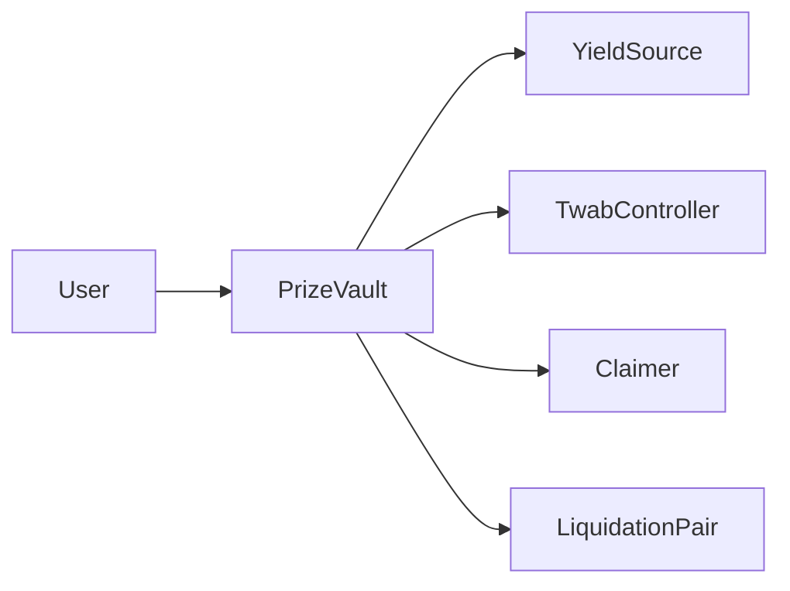

# PoolTogether v5 Vault Security Analysis Report

## Introduction
Analysis of the PoolTogether v5 PrizeVault and PrizeVaultFactory contracts. The analysis focuses on identifying potential vulnerabilities, risks, and areas for improvement in the codebase. The report includes an evaluation of the architecture, code quality, centralization risks, and systemic risks associated with the contracts.

## Approach
The analysis was conducted using a combination of manual code review, automated tools, and scenario-based testing. The following steps were taken:

1. Manual code review: A line-by-line review of the PrizeVault and PrizeVaultFactory contracts was performed to identify potential vulnerabilities and logic flaws.
2. Automated analysis: Static analysis tools such as Slither and MythX were used to detect common security issues and vulnerabilities.
3. Scenario-based testing: Various scenarios were simulated to test the behavior of the contracts under different conditions, including edge cases and extreme values.
4. Architecture review: The overall architecture of the contracts was evaluated to assess its robustness, modularity, and adherence to best practices.

## Architecture Overview
The PoolTogether v5 PrizeVault is an ERC4626-compliant yield aggregator that allows users to deposit assets and earn yield from an underlying yield source. The PrizeVault integrates with various yield sources, such as Yearn, Beefy, sDAI, and Element.

The PrizeVaultFactory contract is responsible for deploying new PrizeVault instances with specific configurations, such as the yield source, fee parameters, and token details.

The architecture of the PrizeVault contract can be summarized as follows:



## Review of [`TwabERC20`](https://github.com/code-423n4/2024-03-pooltogether/blob/main/pt-v5-vault/src/TwabERC20.sol) and [`PrizeVault`](https://github.com/code-423n4/2024-03-pooltogether/blob/main/pt-v5-vault/src/PrizeVault.sol) contracts for their adherence to the ERC20 and ERC4626 standards.

`TwabERC20` ERC20 Compliance: https://github.com/code-423n4/2024-03-pooltogether/blob/main/pt-v5-vault/src/TwabERC20.sol

The `TwabERC20` contract inherits from OpenZeppelin's `ERC20` and `ERC20Permit` contracts, which provide a solid foundation for ERC20 compliance. 

1. `balanceOf(address account)`:
   - Correctly returns the balance of `account` by calling `twabController.balanceOf(address(this), account)`.
   - Properly adheres to the ERC20 standard.

2. `totalSupply()`:
   - Correctly returns the total supply by calling `twabController.totalSupply(address(this))`.
   - Properly adheres to the ERC20 standard.

3. `_mint(address account, uint256 amount)`:
   - Mints `amount` tokens to `account` by calling `twabController.mint(account, uint96(amount))`.
   - Emits a `Transfer` event with `from` set to the zero address, as required by the ERC20 standard.
   - Properly adheres to the ERC20 standard.

4. `_burn(address account, uint256 amount)`:
   - Burns `amount` tokens from `account` by calling `twabController.burn(account, uint96(amount))`.
   - Emits a `Transfer` event with `to` set to the zero address, as required by the ERC20 standard.
   - Properly adheres to the ERC20 standard.

5. `_transfer(address from, address to, uint256 amount)`:
   - Transfers `amount` tokens from `from` to `to` by calling `twabController.transfer(from, to, uint96(amount))`.
   - Emits a `Transfer` event, as required by the ERC20 standard.
   - Properly adheres to the ERC20 standard.

Overall, the `TwabERC20` contract seems to adhere to the ERC20 standard correctly. The overridden functions follow the standard's requirements and emit the necessary events.

`PrizeVault` ERC4626 Compliance: https://github.com/code-423n4/2024-03-pooltogether/blob/main/pt-v5-vault/src/PrizeVaultFactory.sol

The `PrizeVault` contract implements the ERC4626 standard for vault token accounting.

1. `totalAssets()`:
   - Correctly calculates the total assets by adding the yield vault balance (converted to assets) and the PrizeVault's latent asset balance.
   - Properly adheres to the ERC4626 standard.

2. `convertToShares(uint256 assets)` and `convertToAssets(uint256 shares)`:
   - Correctly convert between assets and shares based on the vault's total assets and debt.
   - Handle the case when the vault has insufficient assets by proportionally adjusting the conversion rate.
   - Properly adhere to the ERC4626 standard.

3. `maxDeposit(address)`, `maxMint(address)`, `maxWithdraw(address)`, and `maxRedeem(address)`:
   - Correctly calculate the maximum amount of assets/shares that can be deposited, minted, withdrawn, or redeemed, considering the vault's current state and limits.
   - Properly adhere to the ERC4626 standard.

4. `previewDeposit(uint256 assets)`, `previewMint(uint256 shares)`, `previewWithdraw(uint256 assets)`, and `previewRedeem(uint256 shares)`:
   - Correctly preview the amount of shares/assets that would be minted, deposited, redeemed, or withdrawn based on the vault's current state.
   - Properly adhere to the ERC4626 standard.

5. `deposit(uint256 assets, address receiver)`, `mint(uint256 shares, address receiver)`, `withdraw(uint256 assets, address receiver, address owner)`, and `redeem(uint256 shares, address receiver, address owner)`:
   - Correctly perform the corresponding actions of depositing, minting, withdrawing, or redeeming assets/shares.
   - Update the vault's state and emit the necessary events as required by the ERC4626 standard.
   - Properly adhere to the ERC4626 standard.

## Potential Exploit or Unexpected Behavior:

1. `TwabERC20`:
   - The contract relies on the `TwabController` for balance tracking and transfers. If there are any vulnerabilities or unexpected behavior in the `TwabController`, it could potentially impact the `TwabERC20` contract.
   - However, based on the provided code, there don't seem to be any obvious exploits or unexpected behavior in the ERC20 functions themselves.

2. `PrizeVault`:
   - The `deposit`, `mint`, `withdraw`, and `redeem` functions all rely on the `_depositAndMint` and `_burnAndWithdraw` internal functions for the actual logic.
   - These internal functions perform the necessary state updates and asset transfers.
   - One potential issue is the reliance on the yield vault's `previewDeposit` and `mint` functions during deposits. As discussed in the previous analysis, if the yield vault doesn't return the exact amount of assets used, it could lead to a discrepancy in the PrizeVault's asset accounting.
   - Another potential issue is the reliance on the yield vault's `maxRedeem` and `convertToAssets` functions during withdrawals. If the yield vault's implementations of these functions are incorrect or malicious, it could lead to unexpected behavior or exploits in the PrizeVault.
   - However, barring any issues in the integrated yield vault, the ERC4626 functions in the `PrizeVault` contract itself don't seem to have any obvious exploits or unexpected behavior.

Recommendations:

1. Thoroughly test the `TwabERC20` contract with the integrated `TwabController` to ensure that the balance tracking and transfer logic work as expected and are free from vulnerabilities.

2. Ensure that the integrated yield vaults adhere to the ERC4626 standard strictly, especially in terms of asset accounting and share conversions.

3. Implement additional checks and safeguards in the `PrizeVault` contract to handle potential discrepancies or unexpected behavior from the integrated yield vaults. For example, reverting if the asset amounts don't match the expected values within an acceptable tolerance.

While the `TwabERC20` and `PrizeVault` contracts themselves seem to adhere to the respective standards and don't have obvious exploits, the overall security also depends on the correctness and security of the integrated external contracts, such as the `TwabController` and the yield vaults.

## General Compatibility

The PrizeVault contract assumes that the integrated yield sources adhere to the ERC4626 standard for vault token accounting. This means that the yield sources should implement the following functions correctly:
- `asset()`: Returns the underlying asset token address.
- `totalAssets()`: Returns the total amount of the underlying asset that is "managed" by the yield source.
- `convertToShares(uint256 assets)`: Converts an amount of assets to a corresponding amount of shares.
- `convertToAssets(uint256 shares)`: Converts an amount of shares to a corresponding amount of assets.
- `maxDeposit(address)`, `maxMint(address)`, `maxWithdraw(address)`, `maxRedeem(address)`: Returns the maximum amount of assets/shares that can be deposited, minted, withdrawn, or redeemed by an account.
- `previewDeposit(uint256 assets)`, `previewMint(uint256 shares)`, `previewWithdraw(uint256 assets)`, `previewRedeem(uint256 shares)`: Previews the amount of shares/assets that would be minted, deposited, redeemed, or withdrawn for a given amount of assets/shares.
- `deposit(uint256 assets, address receiver)`, `mint(uint256 shares, address receiver)`, `withdraw(uint256 assets, address receiver, address owner)`, `redeem(uint256 shares, address receiver, address owner)`: Performs the actual deposit, mint, withdrawal, or redemption of assets/shares.

If any of the integrated yield sources don't implement these functions correctly or deviate from the ERC4626 standard, it could lead to compatibility issues with the PrizeVault contract.

## Asset Loss Handling:
The PrizeVault contract assumes that the integrated yield sources are not expected to lose assets under normal circumstances. However, it does have a mechanism to handle asset loss:
- If the yield source loses assets and the total assets become less than the total debt (shares), the PrizeVault enters a "loss state" or "recovery mode".
- In this state, no new deposits or mints are allowed (`maxDeposit()` and `maxMint()` return 0), and no liquidations can occur (`liquidatableBalanceOf()` returns 0).
- Users can still withdraw or redeem their shares, but they will receive a proportionally reduced amount of assets based on the current asset to share ratio.
- The PrizeVault's `convertToAssets()` function handles this by calculating the reduced asset amount based on the current total assets and total debt.

The asset loss handling mechanism relies on the yield source accurately reporting the total assets and allowing withdrawals/redemptions even in a loss state. If a yield source doesn't handle asset loss gracefully or blocks withdrawals, it could break the integration with the PrizeVault.

Specific Yield Sources:

1. Yearn V3:
   - Yearn V3 vaults follow the ERC4626 standard, so they should be compatible with the PrizeVault contract.
   - However, Yearn V3 vaults have a withdrawal fee and a management fee that could impact the asset accounting in the PrizeVault.
   - The PrizeVault assumes that the yield source doesn't charge any fees on deposits, withdrawals, or transfers. If Yearn V3 vaults charge fees, it could lead to discrepancies in the asset balances and break the integration.

2. Beefy:
   - Beefy vaults also follow the ERC4626 standard, so they should be compatible with the PrizeVault contract.
   - However, Beefy vaults have a performance fee that is charged on earned interest. This fee could impact the asset accounting in the PrizeVault.
   - The PrizeVault assumes that the yield source doesn't charge any fees. If Beefy vaults charge fees, it could lead to discrepancies in the asset balances and break the integration.

3. sDAI:
   - sDAI (Streaming DAI) is a wrapper around DAI that allows for streaming payments over time.
   - It's not clear if sDAI follows the ERC4626 standard or if it's directly compatible with the PrizeVault contract.
   - If sDAI doesn't implement the required ERC4626 functions or has a different accounting mechanism, it could break the integration with the PrizeVault.

4. Yield Daddy Aave V3 Wrapper:
   - The Yield Daddy Aave V3 Wrapper is an ERC4626 wrapper around Aave V3 deposits.
   - It should be compatible with the PrizeVault contract as long as it correctly implements the ERC4626 functions.
   - However, if there are any deviations from the standard or if the wrapper doesn't handle asset loss gracefully, it could break the integration.

5. Yield Daddy Lido Wrapper:
   - The Yield Daddy Lido Wrapper is an ERC4626 wrapper around Lido staked ETH (stETH).
   - Similar to the Aave V3 Wrapper, it should be compatible with the PrizeVault contract as long as it correctly implements the ERC4626 functions.
   - However, stETH has its own unique risks and challenges, such as potential liquidity issues and the ETH 2.0 transition. If these risks materialize and impact the wrapper's ability to handle withdrawals or asset loss, it could break the integration.

Recommendations:
1. Thoroughly test the PrizeVault contract with each integrated yield source to ensure compatibility and correct behavior under various scenarios.
2. Pay special attention to how each yield source handles asset loss and ensure that the PrizeVault's recovery mode functions correctly in those situations.
3. Monitor the integrated yield sources for any changes or updates that could impact compatibility with the PrizeVault contract.
4. Consider implementing additional checks and safeguards in the PrizeVault contract to handle potential deviations from the ERC4626 standard or unexpected behavior from the yield sources.
5. Have clear contingency plans and communication strategies in place to handle situations where an integrated yield source experiences issues or breaks compatibility with the PrizeVault.

While the PrizeVault contract is designed to be compatible with ERC4626 yield sources, the actual compatibility and robustness of the integration depend on the specific implementation and behavior of each yield source. 

## Access control mechanisms for trusted roles in the PrizeVault contract, focusing on the vault owner role.

Trusted Role: Vault Owner

The vault owner is a trusted role in the PrizeVault contract. The owner has special privileges and can perform certain administrative actions on the vault.

Access Control Mechanism:
The PrizeVault contract inherits from the `Ownable` contract, which provides the access control mechanism for the owner role. The `Ownable` contract defines the following key components:

1. `owner` state variable: Stores the address of the current owner.
2. `onlyOwner` modifier: Restricts access to functions by allowing only the owner to call them.
3. `transferOwnership` function: Allows the current owner to transfer ownership to a new address.
4. `renounceOwnership` function: Allows the current owner to renounce ownership, leaving the contract without an owner.

Functions Callable by the Owner:
The following functions in the PrizeVault contract can be called by the vault owner:

1. `setClaimer(address _claimer)`:
   - Allows the owner to set the address of the claimer contract.
   - The claimer is responsible for claiming prizes on behalf of users.
   - Potential Impact:
     - The owner can change the claimer contract, which could affect the prize claiming process.
     - If the owner sets an untrusted or malicious claimer contract, it could lead to loss of user funds or incorrect prize distribution.
   - Recommendation:
     - Ensure that only trusted and thoroughly audited claimer contracts are set by the owner.
     - Consider implementing a time-lock or multi-sig mechanism for changing the claimer to prevent unilateral and immediate changes.

2. `setLiquidationPair(address _liquidationPair)`:
   - Allows the owner to set the address of the liquidation pair contract.
   - The liquidation pair is used to liquidate yield and distribute prizes.
   - Potential Impact:
     - The owner can change the liquidation pair contract, which could affect the yield liquidation and prize distribution process.
     - If the owner sets an untrusted or malicious liquidation pair contract, it could lead to loss of user funds or incorrect prize distribution.
   - Recommendation:
     - Ensure that only trusted and thoroughly audited liquidation pair contracts are set by the owner.
     - Consider implementing a time-lock or multi-sig mechanism for changing the liquidation pair to prevent unilateral and immediate changes.

3. `setYieldFeePercentage(uint32 _yieldFeePercentage)`:
   - Allows the owner to set the percentage of yield that is collected as a fee.
   - The yield fee percentage is used to calculate the portion of yield that goes to the fee recipient.
   - Potential Impact:
     - The owner can change the yield fee percentage, which affects the distribution of yield between users and the fee recipient.
     - If the owner sets an unreasonably high fee percentage, it could lead to reduced yield for users and excessive fees for the fee recipient.
   - Recommendation:
     - Implement reasonable limits on the yield fee percentage to prevent excessive fees.
     - Consider implementing a time-lock or multi-sig mechanism for changing the fee percentage to prevent unilateral and immediate changes.
     - Clearly communicate any changes to the yield fee percentage to users.

4. `setYieldFeeRecipient(address _yieldFeeRecipient)`:
   - Allows the owner to set the address of the yield fee recipient.
   - The yield fee recipient receives a portion of the collected yield as a fee.
   - Potential Impact:
     - The owner can change the yield fee recipient, which affects the distribution of fees.
     - If the owner sets an untrusted or malicious fee recipient, it could lead to loss of funds.
   - Recommendation:
     - Ensure that only trusted and verified addresses are set as the yield fee recipient.
     - Consider implementing a time-lock or multi-sig mechanism for changing the fee recipient to prevent unilateral and immediate changes.
     - Clearly communicate any changes to the yield fee recipient to users.

Overall, the access control mechanism for the vault owner role in the PrizeVault contract is based on the `Ownable` contract, which provides a standard ownership model. However, it's important to consider the potential impact and risks associated with the functions that can be called by the owner.

To mitigate risks and prevent unintended consequences, consider implementing additional safeguards, such as:

1. Time-locks or multi-sig mechanisms for critical functions to prevent unilateral and immediate changes.
2. Reasonable limits and validation on input parameters to prevent excessive or invalid values.
3. Clear communication and transparency with users regarding any changes made by the owner.
4. Regular audits and reviews of the owner's actions and the contract's state to identify and address any potential issues.
5. Contingency plans and emergency mechanisms to handle situations where the owner's actions may put user funds at risk.

## Code Quality Analysis
The PrizeVault and PrizeVaultFactory contracts are written in Solidity and follow a modular design pattern. The contracts make use of OpenZeppelin libraries for standard ERC20 and ERC4626 functionality, which reduces the risk of implementation errors.

However, there are a few areas where code quality could be improved:

1. Inconsistent use of error messages: Some functions use custom error messages, while others use generic require statements. It would be better to use custom error messages consistently throughout the codebase.
2. Lack of function documentation: Some functions, especially those with complex logic, would benefit from more detailed NatSpec documentation to improve readability and maintainability.
3. Large function sizes: Some functions, such as `_depositAndMint` and `_burnAndWithdraw`, are quite large and could be broken down into smaller, more focused functions to enhance readability and testability.

## Centralization Risks
The PrizeVault and PrizeVaultFactory contracts have several centralization risks that should be considered:

1. Owner privileges: The PrizeVault contract has an owner account with significant privileges, such as setting the claimer, liquidation pair, and fee parameters. If the owner account is compromised, it could potentially manipulate the vault's behavior.
2. Yield source dependency: The PrizeVault relies on the security and reliability of the integrated yield sources. If a yield source is compromised or fails, it could impact the PrizeVault's ability to generate yield and honor withdrawals.
3. Timelocks and multi-sig: The contracts do not currently implement timelocks or multi-sig mechanisms for critical operations, such as changing the owner or updating fee parameters. Implementing these mechanisms could help mitigate the risk of a single point of failure.

## Mechanism Review
The PrizeVault contract implements several key mechanisms, including deposit/withdrawal, yield generation, and liquidation. Here's a review of these mechanisms:

### Deposit and Withdrawal
The PrizeVault allows users to deposit assets and mint shares using the `deposit` and `mint` functions. The contract also supports deposits with permit, enabling users to deposit assets in a single transaction.

Withdrawals are handled by the `withdraw` and `redeem` functions, which burn shares and transfer the corresponding assets to the user. The contract implements a "dust collection strategy" to handle rounding errors during deposits and withdrawals.

Potential issues:
1. The deposit and withdrawal functions rely on the accuracy of the underlying yield source's `convertToAssets` and `convertToShares` functions. If these functions are manipulated or return incorrect values, it could lead to deposit/withdrawal vulnerabilities.
2. The dust collection strategy may not be sufficient to handle large rounding errors or edge cases, potentially leading to accounting discrepancies.

### Yield Generation
The PrizeVault generates yield by depositing assets into an underlying yield source. The generated yield is periodically harvested and distributed to users based on their share balances.

The contract maintains a yield fee and a yield fee recipient, allowing a portion of the generated yield to be directed to a specified address.

Potential issues:
1. The yield generation mechanism relies on the security and reliability of the integrated yield sources. If a yield source is compromised or fails, it could impact the PrizeVault's ability to generate yield.
2. The yield fee calculation and distribution logic may be vulnerable to rounding errors or edge cases, potentially leading to incorrect fee amounts or distribution.

### Liquidation
The PrizeVault integrates with a liquidation pair contract to periodically harvest yield and contribute it to a prize pool. The liquidation process is triggered by the liquidation pair contract and involves transferring assets from the PrizeVault to the prize pool.

Potential issues:
1. The liquidation process relies on the security and correct implementation of the liquidation pair contract. If the liquidation pair contract is compromised or has vulnerabilities, it could impact the PrizeVault's yield distribution.
2. The liquidation process may be vulnerable to front-running or sandwich attacks, where an attacker manipulates the liquidation timing or asset prices for their own benefit.

## Systemic Risks
The PrizeVault and PrizeVaultFactory contracts are part of a larger ecosystem that includes yield sources, prize pools, and other components. Here are some systemic risks to consider:

1. Yield source failures: If a significant yield source fails or is compromised, it could have a cascading effect on the PrizeVault and other dependent contracts, potentially leading to loss of funds or disruption of services.
2. Prize pool vulnerabilities: If the prize pool contract has vulnerabilities or is compromised, it could impact the PrizeVault's ability to contribute yield and distribute prizes correctly.
3. Governance risks: If the governance mechanism for the PoolTogether ecosystem is compromised or manipulated, it could lead to changes in the PrizeVault's parameters or behavior that are detrimental to users.


## Analysis of the Insufficient Yield Accrual issue in the PrizeVault contract, including its impact, root cause, likelihood, and a possible scenario.

**Impact of the Issue:**
If the yield generated by the deposited assets is not sufficient to cover the rounding errors and maintain the yield buffer, the buffer could gradually deplete over time. This depletion of the yield buffer can lead to several consequences:

1. Inability to Cover Rounding Errors:
   - The primary purpose of the yield buffer is to cover rounding errors during deposits and withdrawals.
   - If the yield buffer is depleted, the PrizeVault contract may not have enough assets to cover the rounding errors, leading to discrepancies in the accounting and potential loss of user funds.

2. Suspension of Deposits and Withdrawals:
   - The PrizeVault contract includes checks to prevent further deposits and withdrawals if the total assets fall below the total debt (user balances).
   - If the yield buffer is depleted and the total assets become less than the total debt, the contract will suspend deposits and withdrawals to prevent further loss of funds.
   - This suspension of deposits and withdrawals can impact the usability and liquidity of the PrizeVault for users.

3. Loss of User Confidence:
   - If the yield buffer depletion leads to the inability to cover rounding errors or the suspension of deposits and withdrawals, it can erode user confidence in the PrizeVault and the PoolTogether protocol as a whole.
   - Users may hesitate to deposit their funds if they perceive a risk of not being able to withdraw their assets or if there are concerns about the stability and reliability of the PrizeVault.

**Root Cause:**
Insufficient Yield Accrual issue lies in the mismatch between the yield generated by the deposited assets and the rounding errors incurred during deposits and withdrawals.

The yield buffer is maintained by the accrued yield on the deposited assets. The expectation is that the yield generated will be sufficient to cover the rounding errors and replenish the yield buffer over time. However, if the yield generated is consistently lower than the rounding errors, the yield buffer will gradually deplete.

**Factors Contributing to Insufficient Yield Accrual:**
1. Low Yield Generation:
   - If the underlying yield vault provides low yields on the deposited assets, it may not generate enough yield to cover the rounding errors and maintain the yield buffer.
   - Factors such as market conditions, interest rates, and the performance of the yield vault's investment strategies can impact the yield generation.

2. Frequent Deposits and Withdrawals:
   - If there are frequent deposits and withdrawals in the PrizeVault, the cumulative rounding errors can add up over time.
   - Each deposit and withdrawal incurs a small rounding error, and if the frequency of these transactions is high, the total rounding errors can exceed the yield generated, leading to the depletion of the yield buffer.

3. Asset Characteristics:
   - The characteristics of the asset being deposited, such as its decimal precision and value, can influence the magnitude of rounding errors.
   - Assets with low decimal precision or high value may result in larger rounding errors, putting more strain on the yield buffer.

**Likelihood of Occurrence:**
The likelihood of the Insufficient Yield Accrual issue occurring depends on several factors:

1. Yield Generation of the Underlying Vault:
   - If the underlying yield vault consistently generates low yields, the risk of insufficient yield accrual increases.
   - The historical performance and expected yield of the yield vault should be carefully evaluated to assess the likelihood of this issue.

2. Market Conditions:
   - Market conditions, such as interest rates and the overall performance of the cryptocurrency market, can impact the yield generation of the underlying vault.
   - During periods of low interest rates or market downturns, the likelihood of insufficient yield accrual may increase.

3. User Behavior:
   - The frequency and volume of deposits and withdrawals by users can influence the cumulative rounding errors.
   - If the PrizeVault experiences high user activity with frequent transactions, the likelihood of insufficient yield accrual may increase.

**Possible Scenario:**
Let's consider a scenario where the PrizeVault is deployed with a yield buffer of 100 tokens and is integrated with an underlying yield vault that generates an average yield of 0.01% per day.

Over time, users interact with the PrizeVault, making deposits and withdrawals. Each deposit and withdrawal incurs a small rounding error of 0.0001 tokens. The cumulative rounding errors over a period of 30 days amount to 0.3 tokens (0.0001 tokens × 3000 transactions).

However, during the same period, the yield generated by the deposited assets is only 0.2 tokens (0.01% × 30 days × 10,000 tokens deposited). The yield generated is not sufficient to cover the cumulative rounding errors, resulting in a net depletion of the yield buffer by 0.1 tokens.

If this trend continues over an extended period, the yield buffer will gradually deplete. Once the yield buffer is fully depleted, the PrizeVault will not have enough assets to cover the rounding errors, leading to discrepancies in the accounting and potential loss of user funds.

**Code:**
The Insufficient Yield Accrual issue is not directly tied to a specific line of code but rather to the overall design and assumptions of the [PrizeVault contract](https://github.com/code-423n4/2024-03-pooltogether/blob/main/pt-v5-vault/src/PrizeVault.sol).

1. Yield Buffer Initialization:
   - The yield buffer is set during contract deployment in the constructor: https://github.com/code-423n4/2024-03-pooltogether/blob/480d58b9e8611c13587f28811864aea138a0021a/pt-v5-vault/src/PrizeVault.sol#L289-L313
     ```solidity
     constructor(
         // ...
         uint256 yieldBuffer_,
         // ...
     ) {
         // ...
         yieldBuffer = yieldBuffer_;
         // ...
     }
     ```
   - The yield buffer is expected to be of insignificant value and is used to cover rounding errors.

2. Deposit and Withdrawal Logic:
   - The `_depositAndMint` function handles the deposit logic and includes the dust collection strategy: https://github.com/code-423n4/2024-03-pooltogether/blob/480d58b9e8611c13587f28811864aea138a0021a/pt-v5-vault/src/PrizeVault.sol#L843-L877
     ```solidity
     function _depositAndMint(address _caller, address _receiver, uint256 _assets, uint256 _shares) internal {
         // ...
         uint256 _assetsWithDust = _asset.balanceOf(address(this));
         _asset.approve(address(yieldVault), _assetsWithDust);
         uint256 _yieldVaultShares = yieldVault.previewDeposit(_assetsWithDust);
         uint256 _assetsUsed = yieldVault.mint(_yieldVaultShares, address(this));
         if (_assetsUsed != _assetsWithDust) {
             _asset.approve(address(yieldVault), 0);
         }
         // ...
     }
     ```
   - The `_withdraw` function handles the withdrawal logic and considers the latent assets and dust:
     ```solidity
     function _withdraw(address _receiver, uint256 _assets) internal {
         uint256 _latentAssets = _asset.balanceOf(address(this));
         if (_assets > _latentAssets) {
             uint256 _yieldVaultShares = yieldVault.previewWithdraw(_assets - _latentAssets);
             yieldVault.redeem(_yieldVaultShares, address(this), address(this));
         }
         if (_receiver != address(this)) {
             _asset.transfer(_receiver, _assets);
         }
     }
     ```
   - These functions handle the rounding errors and dust collection but do not directly account for the yield generation.

3. Yield Buffer Checks:
   - The `_availableYieldBalance` function checks if the total yield balance exceeds the yield buffer: https://github.com/code-423n4/2024-03-pooltogether/blob/480d58b9e8611c13587f28811864aea138a0021a/pt-v5-vault/src/PrizeVault.sol#L823-L833
     ```solidity
     function _availableYieldBalance(uint256 _totalAssets, uint256 totalDebt_) internal view returns (uint256) {
         uint256 totalYieldBalance_ = _totalYieldBalance(_totalAssets, totalDebt_);
         uint256 _yieldBuffer = yieldBuffer;
         if (totalYieldBalance_ >= _yieldBuffer) {
             unchecked {
                 return totalYieldBalance_ - _yieldBuffer;
             }
         } else {
             return 0;
         }
     }
     ```
   - This function is used to determine the available yield balance that can be liquidated, considering the yield buffer.

## Recommendations
To mitigate the risk of Insufficient Yield Accrual and its impact on the PrizeVault, the following recommendations can be considered:

1. Careful Selection of Yield Vaults:
   - Conduct thorough due diligence on the underlying yield vaults to ensure they have a track record of generating sufficient yields.
   - Evaluate the historical performance, investment strategies, and risk profile of the yield vaults to assess their ability to generate consistent yields.

2. Monitoring and Adjustment of Yield Buffer:
   - Regularly monitor the yield generation and the yield buffer balance to detect any signs of insufficient yield accrual.
   - If the yield buffer shows a declining trend, consider adjusting the yield buffer size or exploring alternative yield vaults with higher yield potential.

3. Contingency Mechanisms:
   - Implement contingency mechanisms to handle scenarios where the yield buffer is depleted, such as temporary suspension of deposits and withdrawals.
   - Communicate transparently with users about the status of the yield buffer and any measures taken to address the issue.

4. Diversification of Yield Sources:
   - Consider diversifying the yield sources by integrating with multiple yield vaults or strategies.
   - Diversification can help mitigate the risk of relying on a single yield source and provide more robustness to the PrizeVault.

5. User Education and Risk Disclosure:
   - Clearly communicate the risks associated with the PrizeVault, including the potential for insufficient yield accrual and its impact on the yield buffer.
   - Educate users about the factors that can influence yield generation and the importance of considering market conditions and yield vault performance.

> It's important to note that the Insufficient Yield Accrual issue is not a vulnerability in the strict sense but rather a limitation of the current design and assumptions of the PrizeVault contract. Addressing this issue requires careful consideration of the underlying yield vaults, market conditions, and user behavior, as well as implementing appropriate monitoring, contingency planning, and risk management strategies.


## An in-depth analysis of the issue of large rounding errors exceeding the yield buffer in the PrizeVault contract, including its impact, root cause, likelihood, and a descriptive scenario.

**Impact of the Issue:**
If the rounding errors during deposits and withdrawals are significantly larger than expected, the yield buffer may not be sufficient to cover them. This can lead to several consequences:

1. Inconsistent Accounting:
   - If the rounding errors exceed the yield buffer, the PrizeVault contract may not have enough assets to cover the discrepancies.
   - This can result in inconsistent accounting, where the total assets in the vault do not match the total debt (user balances) plus the yield buffer.
   - Inconsistent accounting can lead to discrepancies in user balances and the overall integrity of the PrizeVault.

2. Potential Loss of User Funds:
   - If the rounding errors are not adequately covered by the yield buffer, users may experience a loss of funds.
   - When a user withdraws their assets, they may receive less than their expected balance due to the uncovered rounding errors.
   - This loss of funds can erode user trust and confidence in the PrizeVault and the PoolTogether protocol.

3. Suspension of Deposits and Withdrawals:
   - If the rounding errors significantly deplete the yield buffer, the PrizeVault contract may suspend deposits and withdrawals to prevent further loss of funds.
   - The contract includes checks to prevent deposits and withdrawals if the total assets fall below the total debt.
   - Suspension of deposits and withdrawals can impact the usability and liquidity of the PrizeVault for users.

**Root Cause:**
The root cause of large rounding errors exceeding the yield buffer can be attributed to two main factors:

1. Low Decimal Precision of the Asset:
   - If the asset being deposited and withdrawn has a low decimal precision, it can result in larger rounding errors.
   - For example, if the asset has only 6 decimal places (e.g., USDC), rounding errors can be more significant compared to assets with 18 decimal places (e.g., DAI).
   - The lower the decimal precision, the larger the potential rounding errors during deposit and withdrawal calculations.

2. Issues with Yield Vault's Rounding Calculations:
   - If there are issues or inconsistencies in the yield vault's rounding calculations, it can lead to larger rounding errors.
   - The yield vault's `previewDeposit`, `previewWithdraw`, and other functions that involve calculations may introduce rounding errors.
   - If these functions do not handle rounding consistently or if there are bugs in their implementations, it can result in larger than expected rounding errors.

**Likelihood of Occurrence:**
The likelihood of large rounding errors exceeding the yield buffer depends on several factors:

1. Asset Characteristics:
   - The likelihood of this issue occurring is higher for assets with low decimal precision.
   - Assets like USDC (6 decimals) or USDT (6 decimals) are more likely to experience larger rounding errors compared to assets like DAI (18 decimals) or WETH (18 decimals).

2. Yield Vault Implementation:
   - The likelihood of this issue depends on the correctness and consistency of the yield vault's rounding calculations.
   - If the yield vault has been thoroughly tested and audited, the chances of issues with rounding calculations are lower.
   - However, if there are bugs or inconsistencies in the yield vault's implementation, the likelihood of larger rounding errors increases.

3. Deposit and Withdrawal Patterns:
   - The frequency and size of deposits and withdrawals can impact the cumulative rounding errors.
   - If there are frequent deposits and withdrawals of small amounts, the rounding errors can accumulate more quickly.
   - Large deposits and withdrawals may also introduce more significant rounding errors.

**Descriptive Scenario:**
Let's consider a scenario where the PrizeVault is deployed with a yield buffer of 100 tokens and is integrated with an underlying yield vault. The asset being deposited and withdrawn is USDC, which has 6 decimal places.

A user deposits 1000 USDC into the PrizeVault. Due to the low decimal precision of USDC, the deposit calculation in the yield vault introduces a rounding error of 0.01 USDC. The PrizeVault mints shares to the user based on the deposited amount minus the rounding error.

Over time, multiple users interact with the PrizeVault, depositing and withdrawing USDC. Each deposit and withdrawal introduces a rounding error of around 0.01 USDC.

After a significant number of transactions, the cumulative rounding errors exceed the yield buffer of 100 USDC. The PrizeVault contract does not have enough assets to cover the rounding errors, leading to inconsistent accounting and potential loss of user funds.

When a user attempts to withdraw their USDC, they may receive less than their expected balance due to the uncovered rounding errors. The PrizeVault contract may also suspend further deposits and withdrawals to prevent additional loss of funds.

**Code:**
The relevant parts of the code that are involved in the rounding error calculations:

1. Deposit Logic:
   - The `_depositAndMint` function handles the deposit logic and introduces rounding errors: https://github.com/code-423n4/2024-03-pooltogether/blob/480d58b9e8611c13587f28811864aea138a0021a/pt-v5-vault/src/PrizeVault.sol#L843-L877
     ```solidity
     function _depositAndMint(address _caller, address _receiver, uint256 _assets, uint256 _shares) internal {
         // ...
         uint256 _assetsWithDust = _asset.balanceOf(address(this));
         _asset.approve(address(yieldVault), _assetsWithDust);
         uint256 _yieldVaultShares = yieldVault.previewDeposit(_assetsWithDust);
         uint256 _assetsUsed = yieldVault.mint(_yieldVaultShares, address(this));
         // ...
     }
     ```
   - The rounding errors occur in the `yieldVault.previewDeposit` and `yieldVault.mint` functions, which are external calls to the yield vault.

2. Withdrawal Logic:
   - The `_withdraw` function handles the withdrawal logic and introduces rounding errors: https://github.com/code-423n4/2024-03-pooltogether/blob/480d58b9e8611c13587f28811864aea138a0021a/pt-v5-vault/src/PrizeVault.sol#L928-L941
     ```solidity
     function _withdraw(address _receiver, uint256 _assets) internal {
         uint256 _latentAssets = _asset.balanceOf(address(this));
         if (_assets > _latentAssets) {
             uint256 _yieldVaultShares = yieldVault.previewWithdraw(_assets - _latentAssets);
             yieldVault.redeem(_yieldVaultShares, address(this), address(this));
         }
         // ...
     }
     ```
   - The rounding errors occur in the `yieldVault.previewWithdraw` and `yieldVault.redeem` functions, which are external calls to the yield vault.

3. Yield Buffer Checks:
   - The `_availableYieldBalance` function checks if the total yield balance exceeds the yield buffer: https://github.com/code-423n4/2024-03-pooltogether/blob/480d58b9e8611c13587f28811864aea138a0021a/pt-v5-vault/src/PrizeVault.sol#L823-L833
     ```solidity
     function _availableYieldBalance(uint256 _totalAssets, uint256 totalDebt_) internal view returns (uint256) {
         uint256 totalYieldBalance_ = _totalYieldBalance(_totalAssets, totalDebt_);
         uint256 _yieldBuffer = yieldBuffer;
         if (totalYieldBalance_ >= _yieldBuffer) {
             // ...
         } else {
             return 0;
         }
     }
     ```
   - If the total yield balance is less than the yield buffer, the available yield balance is considered to be zero.

**Recommendations:**
To mitigate the risk of large rounding errors exceeding the yield buffer, the following recommendations can be considered:

1. Thorough Testing and Auditing:
   - Conduct thorough testing and auditing of the yield vault's rounding calculations to ensure consistency and accuracy.
   - Verify that the yield vault's functions handle rounding in a predictable and reliable manner.
   - Identify and fix any bugs or inconsistencies in the yield vault's implementation that may contribute to larger rounding errors.

2. Monitoring and Adjustment of Yield Buffer:
   - Regularly monitor the cumulative rounding errors and compare them against the yield buffer.
   - If the rounding errors approach or exceed the yield buffer, consider adjusting the yield buffer size to accommodate the larger errors.
   - Dynamically increasing the yield buffer based on the observed rounding errors can help mitigate the risk of insufficient buffer.

3. Asset Selection:
   - Carefully consider the decimal precision of the assets supported by the PrizeVault.
   - Prioritize assets with higher decimal precision (e.g., 18 decimals) to minimize the impact of rounding errors.
   - If supporting assets with low decimal precision is necessary, consider implementing additional safeguards or increasing the yield buffer size accordingly.

4. User Education and Risk Disclosure:
   - Clearly communicate to users the potential risks associated with rounding errors and the limitations of the yield buffer.
   - Educate users about the impact of asset decimal precision on rounding errors and the possibility of inconsistencies in accounting.
   - Provide transparent information about the yield buffer size and its ability to cover rounding errors under different scenarios.

5. Robust Error Handling and Fallback Mechanisms:
   - Implement robust error handling mechanisms to detect and handle cases where the rounding errors exceed the yield buffer.
   - Consider implementing fallback mechanisms, such as temporarily suspending deposits and withdrawals, to prevent further loss of funds.
   - Notify users promptly and provide clear guidance on the steps being taken to address the issue.

It's important to note that while the issue of large rounding errors exceeding the yield buffer is not a direct vulnerability in the PrizeVault contract itself, it can lead to undesirable consequences such as inconsistent accounting and potential loss of user funds. Addressing this issue requires a combination of thorough testing, monitoring, asset selection, user education, and robust error handling mechanisms.

Collaborating closely with the yield vault providers and ensuring the correctness and consistency of their rounding calculations is crucial to mitigate the risk of large rounding errors. Regular audits and ongoing monitoring of the yield vault's performance can help identify and address any issues promptly.

By implementing the recommended measures and maintaining transparency with users, the impact of large rounding errors exceeding the yield buffer can be minimized, ensuring the integrity and reliability of the PrizeVault contract.


## In-depth analysis of the issue of large rounding errors exceeding the yield buffer in the PrizeVault contract, including its impact, root cause, likelihood, and a descriptive scenario.

**Impact of the Issue:**
If the rounding errors during deposits and withdrawals are significantly larger than expected, the yield buffer may not be sufficient to cover them. This can lead to several consequences:

1. Inconsistent Accounting:
   - If the rounding errors exceed the yield buffer, the PrizeVault contract may not have enough assets to cover the discrepancies.
   - This can result in inconsistent accounting, where the total assets in the vault do not match the total debt (user balances) plus the yield buffer.
   - Inconsistent accounting can lead to discrepancies in user balances and the overall integrity of the PrizeVault.

2. Potential Loss of User Funds:
   - If the rounding errors are not adequately covered by the yield buffer, users may experience a loss of funds.
   - When a user withdraws their assets, they may receive less than their expected balance due to the uncovered rounding errors.
   - This loss of funds can erode user trust and confidence in the PrizeVault and the PoolTogether protocol.

3. Suspension of Deposits and Withdrawals:
   - If the rounding errors significantly deplete the yield buffer, the PrizeVault contract may suspend deposits and withdrawals to prevent further loss of funds.
   - The contract includes checks to prevent deposits and withdrawals if the total assets fall below the total debt.
   - Suspension of deposits and withdrawals can impact the usability and liquidity of the PrizeVault for users.

**Root Cause:**
The root cause of large rounding errors exceeding the yield buffer can be attributed to two main factors:

1. Low Decimal Precision of the Asset:
   - If the asset being deposited and withdrawn has a low decimal precision, it can result in larger rounding errors.
   - For example, if the asset has only 6 decimal places (e.g., USDC), rounding errors can be more significant compared to assets with 18 decimal places (e.g., DAI).
   - The lower the decimal precision, the larger the potential rounding errors during deposit and withdrawal calculations.

2. Issues with Yield Vault's Rounding Calculations:
   - If there are issues or inconsistencies in the yield vault's rounding calculations, it can lead to larger rounding errors.
   - The yield vault's `previewDeposit`, `previewWithdraw`, and other functions that involve calculations may introduce rounding errors.
   - If these functions do not handle rounding consistently or if there are bugs in their implementations, it can result in larger than expected rounding errors.

**Likelihood of Occurrence:**
The likelihood of large rounding errors exceeding the yield buffer depends on several factors:

1. Asset Characteristics:
   - The likelihood of this issue occurring is higher for assets with low decimal precision.
   - Assets like USDC (6 decimals) or USDT (6 decimals) are more likely to experience larger rounding errors compared to assets like DAI (18 decimals) or WETH (18 decimals).

2. Yield Vault Implementation:
   - The likelihood of this issue depends on the correctness and consistency of the yield vault's rounding calculations.
   - If the yield vault has been thoroughly tested and audited, the chances of issues with rounding calculations are lower.
   - However, if there are bugs or inconsistencies in the yield vault's implementation, the likelihood of larger rounding errors increases.

3. Deposit and Withdrawal Patterns:
   - The frequency and size of deposits and withdrawals can impact the cumulative rounding errors.
   - If there are frequent deposits and withdrawals of small amounts, the rounding errors can accumulate more quickly.
   - Large deposits and withdrawals may also introduce more significant rounding errors.

**Descriptive Scenario:**
Let's consider a scenario where the PrizeVault is deployed with a yield buffer of 100 tokens and is integrated with an underlying yield vault. The asset being deposited and withdrawn is USDC, which has 6 decimal places.

A user deposits 1000 USDC into the PrizeVault. Due to the low decimal precision of USDC, the deposit calculation in the yield vault introduces a rounding error of 0.01 USDC. The PrizeVault mints shares to the user based on the deposited amount minus the rounding error.

Over time, multiple users interact with the PrizeVault, depositing and withdrawing USDC. Each deposit and withdrawal introduces a rounding error of around 0.01 USDC.

After a significant number of transactions, the cumulative rounding errors exceed the yield buffer of 100 USDC. The PrizeVault contract does not have enough assets to cover the rounding errors, leading to inconsistent accounting and potential loss of user funds.

When a user attempts to withdraw their USDC, they may receive less than their expected balance due to the uncovered rounding errors. The PrizeVault contract may also suspend further deposits and withdrawals to prevent additional loss of funds.

**Code:**

1. Deposit Logic:
   - The `_depositAndMint` function handles the deposit logic and introduces rounding errors: https://github.com/code-423n4/2024-03-pooltogether/blob/480d58b9e8611c13587f28811864aea138a0021a/pt-v5-vault/src/PrizeVault.sol#L843-L870
     ```solidity
     function _depositAndMint(address _caller, address _receiver, uint256 _assets, uint256 _shares) internal {
         // ...
         uint256 _assetsWithDust = _asset.balanceOf(address(this));
         _asset.approve(address(yieldVault), _assetsWithDust);
         uint256 _yieldVaultShares = yieldVault.previewDeposit(_assetsWithDust);
         uint256 _assetsUsed = yieldVault.mint(_yieldVaultShares, address(this));
         // ...
     }
     ```
   - The rounding errors occur in the `yieldVault.previewDeposit` and `yieldVault.mint` functions, which are external calls to the yield vault.

2. Withdrawal Logic:
   - The `_withdraw` function handles the withdrawal logic and introduces rounding errors: https://github.com/code-423n4/2024-03-pooltogether/blob/480d58b9e8611c13587f28811864aea138a0021a/pt-v5-vault/src/PrizeVault.sol#L928-L941
     ```solidity
     function _withdraw(address _receiver, uint256 _assets) internal {
         uint256 _latentAssets = _asset.balanceOf(address(this));
         if (_assets > _latentAssets) {
             uint256 _yieldVaultShares = yieldVault.previewWithdraw(_assets - _latentAssets);
             yieldVault.redeem(_yieldVaultShares, address(this), address(this));
         }
         // ...
     }
     ```
   - The rounding errors occur in the `yieldVault.previewWithdraw` and `yieldVault.redeem` functions, which are external calls to the yield vault.

3. Yield Buffer Checks:
   - The `_availableYieldBalance` function checks if the total yield balance exceeds the yield buffer: https://github.com/code-423n4/2024-03-pooltogether/blob/480d58b9e8611c13587f28811864aea138a0021a/pt-v5-vault/src/PrizeVault.sol#L823-L833
     ```solidity
     function _availableYieldBalance(uint256 _totalAssets, uint256 totalDebt_) internal view returns (uint256) {
         uint256 totalYieldBalance_ = _totalYieldBalance(_totalAssets, totalDebt_);
         uint256 _yieldBuffer = yieldBuffer;
         if (totalYieldBalance_ >= _yieldBuffer) {
             // ...
         } else {
             return 0;
         }
     }
     ```
   - If the total yield balance is less than the yield buffer, the available yield balance is considered to be zero.

**Recommendations:**
To mitigate the risk of large rounding errors exceeding the yield buffer, the following recommendations can be considered:

1. Thorough Testing and Auditing:
   - Conduct thorough testing and auditing of the yield vault's rounding calculations to ensure consistency and accuracy.
   - Verify that the yield vault's functions handle rounding in a predictable and reliable manner.
   - Identify and fix any bugs or inconsistencies in the yield vault's implementation that may contribute to larger rounding errors.

2. Monitoring and Adjustment of Yield Buffer:
   - Regularly monitor the cumulative rounding errors and compare them against the yield buffer.
   - If the rounding errors approach or exceed the yield buffer, consider adjusting the yield buffer size to accommodate the larger errors.
   - Dynamically increasing the yield buffer based on the observed rounding errors can help mitigate the risk of insufficient buffer.

3. Asset Selection:
   - Carefully consider the decimal precision of the assets supported by the PrizeVault.
   - Prioritize assets with higher decimal precision (e.g., 18 decimals) to minimize the impact of rounding errors.
   - If supporting assets with low decimal precision is necessary, consider implementing additional safeguards or increasing the yield buffer size accordingly.

4. User Education and Risk Disclosure:
   - Clearly communicate to users the potential risks associated with rounding errors and the limitations of the yield buffer.
   - Educate users about the impact of asset decimal precision on rounding errors and the possibility of inconsistencies in accounting.
   - Provide transparent information about the yield buffer size and its ability to cover rounding errors under different scenarios.

5. Robust Error Handling and Fallback Mechanisms:
   - Implement robust error handling mechanisms to detect and handle cases where the rounding errors exceed the yield buffer.
   - Consider implementing fallback mechanisms, such as temporarily suspending deposits and withdrawals, to prevent further loss of funds.
   - Notify users promptly and provide clear guidance on the steps being taken to address the issue.

It's important to note that while the issue of large rounding errors exceeding the yield buffer is not a direct vulnerability in the PrizeVault contract itself, it can lead to undesirable consequences such as inconsistent accounting and potential loss of user funds. Addressing this issue requires a combination of thorough testing, monitoring, asset selection, user education, and robust error handling mechanisms.

Collaborating closely with the yield vault providers and ensuring the correctness and consistency of their rounding calculations is crucial to mitigate the risk of large rounding errors. Regular audits and ongoing monitoring of the yield vault's performance can help identify and address any issues promptly.

By implementing the recommended measures and maintaining transparency with users, the impact of large rounding errors exceeding the yield buffer can be minimized, ensuring the integrity and reliability of the PrizeVault contract.

## Recommendations
Based on the analysis conducted, here are some recommendations to enhance the security and robustness of the PrizeVault and PrizeVaultFactory contracts:

1. Implement timelocks and multi-sig mechanisms for critical operations, such as changing the owner or updating fee parameters, to mitigate the risk of a single point of failure.
2. Conduct thorough audits and testing of the integrated yield sources to ensure their security and reliability.
3. Improve the documentation and comments in the codebase to enhance readability and maintainability.
4. Consider implementing additional checks and validation mechanisms to handle edge cases and prevent accounting discrepancies.
5. Regularly monitor and review the liquidation process to detect and prevent any potential attacks or manipulation.
6. Establish a robust governance framework and emergency response plan to address systemic risks and potential failures in the ecosystem.

## Conclusion
The PoolTogether v5 PrizeVault and PrizeVaultFactory contracts provide a mechanism for users to earn yield and participate in prize pools. While the contracts follow a modular design and utilize established libraries, there are certain risks and areas for improvement that should be addressed.

The centralization risks, such as owner privileges and yield source dependencies, should be mitigated through the implementation of timelocks, multi-sig, and thorough audits. The deposit/withdrawal and liquidation mechanisms should be further tested and validated to ensure their robustness and resistance to attacks.

Overall, the PoolTogether v5 vault contracts provide a solid foundation for a yield aggregation and prize distribution system. However, continuous monitoring, testing, and improvements are necessary to maintain the security and integrity of the system.

### Time spent:
49 hours