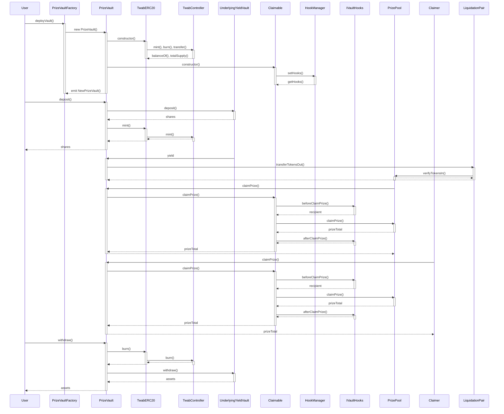

| Serial No. | Topic                                           |
|------------|-------------------------------------------------|
| 01        | Overview of PoolTogether                         |
| 02        | Architecture view (Sequence Diagram)             |
| 03        | Protocol Roles                                   |
| 04        | Approach Taken in auditing PoolTogether          |
| 05        | Contract Analysis                                |
| 06        | Codebase Quality (Table)                         |
| 07        | Centralization Risks                             |
| 08        | Systematic Risks                                 |
| 09        | Architectural Improvement                        |
| 10        | Time spent                                       |


# Overview of PoolTogether

PoolTogether V5 is a decentralized protocol that enables users to participate in a prize-linked savings system. The protocol allows users to deposit assets into vaults, which generate yield through underlying yield sources. The generated yield is then used to fund prizes that are randomly awarded to depositors, creating an exciting and engaging savings experience.

The core components of the PoolTogether V5 protocol include:

**PrizeVault**: The `PrizeVault` contract is an ERC4626-compliant vault that accepts user deposits and generates yield through an underlying yield vault. It employs a "dust collection strategy" and a "yield buffer" to minimize rounding errors and ensure that depositors can withdraw their full deposit amount. The vault is designed to be compatible with various yield sources and promotes the "no loss" spirit of PoolTogether.

```solidity
contract PrizeVault is TwabERC20, Claimable, IERC4626, ILiquidationSource, Ownable {
    // ...
}
```

**PrizeVaultFactory**: The `PrizeVaultFactory` contract simplifies the process of creating new prize vaults by allowing users to provide the necessary parameters, such as the vault name, symbol, yield vault address, prize pool address, and fee configurations. The factory maintains a list of all deployed vaults and verifies their deployment.

```solidity
contract PrizeVaultFactory {
    // ...
}
```

**TwabERC20**: The `TwabERC20` contract is an ERC20 token implementation that stores token balances in a `TwabController`, enabling time-weighted average balances (TWAB) for each token holder. This contract serves as an accounting layer for the prize vaults, ensuring accurate balance tracking and compatibility with the PoolTogether V5 Prize Pool.

```solidity
contract TwabERC20 is ERC20, ERC20Permit {
    // ...
}
```

**Claimable**: The `Claimable` contract is an abstract contract that provides an interface for Claimer contracts to interact with prize vaults. It allows each account to set and manage prize hooks that are called when they win a prize. This enables customization of the prize claiming process and integration with external systems.

```solidity
abstract contract Claimable is HookManager, IClaimable {
    // ...
}
```

**HookManager**: The `HookManager` contract allows each account to set and manage prize hooks that can be called when they win a prize. It maintains a mapping of user addresses to their respective `VaultHooks` structs, which contain information about the hooks they want to execute upon winning.

```solidity
abstract contract HookManager {
    // ...
}
```

**IVaultHooks**: The `IVaultHooks` interface defines a set of hooks that can be implemented by a smart contract to customize the behavior of a vault when a user wins a prize. It includes `beforeClaimPrize` and `afterClaimPrize` hooks, which are triggered before and after the prize claiming process, respectively.

```solidity
interface IVaultHooks {
    // ...
}
```

PoolTogether leverages these components to create a seamless and customizable prize savings experience. Users can deposit assets into prize vaults, which generate yield and contribute to the prize pool. The protocol utilizes a fair and transparent random number generation process to determine prize winners, and the Claimable contract enables automatic prize distribution to winners. One of the key features of PoolTogether V5 is its modularity and extensibility. The protocol allows for the creation of new prize vaults with different underlying yield sources, providing flexibility and diversification for users. The HookManager and IVaultHooks components enable users to customize their prize claiming experience by setting up hooks to execute additional actions or integrate with external systems upon winning.


# Architecture view (Diagram):

If the sequence diagram is not visible or showing mermaid code of that diagram, please [CLICK HERE](https://mermaid.live/edit#pako:eNrtV01v2zAM_SuGThuQFHE6J6kPvWQbVmBbi7UdsCEXxmZSoY7kynIzt-h_r-ykjixLSfpx2KEnQ6L0RD0-kfQ9iXiMJCQZ3uTIIvxMYS5gMWGe56UgJI1oCkx6lxmK1uSZoHf4G_JEfoVIclFsWdEyXSxh-uXXuN-zWsacScGTxHLqJYtRJAVl8z8Uk9iOPk6ALmCaYMvyjfPrH8BgboE-qcDKFZn9KmecJ_azLGjf6U1OY5CUszOgyl6tKJnsHh-3uAu9GNOEF9Xch4_VWmWhtyDRwXRrtoEbegyX2ho3pgGmUOrghF7EWSZFXuKbCM0Q1qP1_k0IQ29BmTq_401zwcqvFMCyGVoRjdA3p7pN56aQgFLt6awC5RKS8zxNk2KNG-M2ZMO6uUmDilpJW6lo6q0eqf2a3kIvw5W6zO2mKLVxt-nDvImg3cHE0ExN77Tr2YWICyq9n7hsaUeDNNRjtdRatQu_UjzP6LOUaXv9TiBnqrAZuoZz2RUIzMzbOSFd72cl_dc9nNc9kj2ewsYFg4S9H0oZmqySuJU2PaTuCDTPLkrD_sow0m1YJ5kLfo0sO81bRLYStDIac08ulYk_9G5R0FmxwjthVtnWFaIedW2-Wfmp95pO7AiK7R7buN-41sSNyjRRTTznReoJ0gngzo9azVX5HGdc4NgJYxZobWzkSYGqClNkrfRkQui-aKHewYU9zNr5aTl_UVak7aF2UgEzieItmNifAEMO7ivsrCcrDncKcd05vcvwXYZvLcO1tHYy0KhJ7Q5lSeVVLGD5wuZ51e--tPi7dv93xd_VlrnYe1VfBpnqol_Ul9U9ih1is5J0iNLOAmisfo3vy3UTIq9wgROiWCExiOsJmbAHtQ5yyc8LFpFQ_Rlgh-SpKsRPv9FPk-p38C_n-pCE9-QfCY-GB4eDYTAc9A77R74fDDukIGE_GB30R_7gkx8M_F4QjB465K7a3zsYjILA7wf9obKNev7RwyPQrYJj)


# Protocol Roles:


PoolTogether involves several key roles and actors that interact with the system. Each role has specific responsibilities and functions within the protocol. Let's explore these roles in detail:

1. **User**: Users are the primary participants in the PoolTogether V5 protocol. They interact with the protocol by depositing assets into PrizeVaults, which allows them to earn yield and have a chance to win prizes. Users can also withdraw their assets from the vaults when desired. The main functions that users interact with are `deposit()` and `withdraw()` in the `PrizeVault` contract.

```solidity
function deposit(uint256 _assets, address _receiver) external returns (uint256) {
    uint256 _shares = previewDeposit(_assets);
    _depositAndMint(msg.sender, _receiver, _assets, _shares);
    return _shares;
}

function withdraw(uint256 _assets, address _receiver, address _owner) external returns (uint256) {
    uint256 _shares = previewWithdraw(_assets);
    _burnAndWithdraw(msg.sender, _receiver, _owner, _shares, _assets);
    return _shares;
}
```

2. **Prize Vault**: Prize Vaults are the core components of the PoolTogether V5 protocol. They accept user deposits, generate yield through underlying yield vaults, and contribute a portion of the yield to the Prize Pool for prize distribution. Each Prize Vault is an instance of the `PrizeVault` contract and is responsible for managing user deposits, minting and burning vault shares, and interacting with the underlying yield source.

3. **Prize Vault Factory**: The Prize Vault Factory, represented by the `PrizeVaultFactory` contract, is responsible for deploying new Prize Vaults. It provides a simple and standardized way to create Prize Vaults with specific configurations, such as the vault name, symbol, underlying yield vault, prize pool, and fee settings. The factory maintains a list of all deployed Prize Vaults and emits events when new vaults are created.

```solidity
function deployVault(
    string memory _name,
    string memory _symbol,
    IERC4626 _yieldVault,
    PrizePool _prizePool,
    address _claimer,
    address _yieldFeeRecipient,
    uint32 _yieldFeePercentage,
    address _owner
) external returns (PrizeVault) {
    PrizeVault _vault = new PrizeVault{
        salt: keccak256(abi.encode(msg.sender, deployerNonces[msg.sender]++))
    }(
        _name,
        _symbol,
        _yieldVault,
        _prizePool,
        _claimer,
        _yieldFeeRecipient,
        _yieldFeePercentage,
        YIELD_BUFFER,
        _owner
    );
    // ...
}
```

4. **Underlying Yield Vault**: Underlying Yield Vaults are external yield-generating contracts that Prize Vaults interact with to earn yield on the deposited assets. These vaults can be any ERC4626-compliant yield source, such as lending protocols, liquidity pools, or other investment strategies. The Prize Vault deposits assets into the underlying yield vault and periodically harvests the generated yield.

5. **Prize Pool**: The Prize Pool, represented by the `PrizePool` contract, is responsible for managing the prize distribution process. It receives yield contributions from Prize Vaults through the Liquidation Pair and determines prize winners based on a randomization mechanism. The Prize Pool maintains a balance of prize tokens and handles the claiming of prizes by winners.

6. **Claimer**: The Claimer, typically implemented as a separate contract, is responsible for claiming prizes on behalf of winners. When a user wins a prize, the Prize Vault interacts with the Claimer contract to initiate the prize claiming process. The Claimer contract calls the `claimPrize()` function in the Prize Vault, which in turn calls the corresponding function in the Prize Pool to transfer the prize to the winner. This allows for a more flexible and customizable prize claiming process.

```solidity
function claimPrize(
    address _winner,
    uint8 _tier,
    uint32 _prizeIndex,
    uint96 _reward,
    address _rewardRecipient
) external onlyClaimer returns (uint256) {
    // ...
    uint256 prizeTotal = prizePool.claimPrize(
        _winner,
        _tier,
        _prizeIndex,
        recipient,
        _reward,
        _rewardRecipient
    );
    // ...
}
```

7. **Liquidation Pair**: The Liquidation Pair, represented by the `LiquidationPair` contract, acts as an intermediary between the Prize Vault and the Prize Pool. It is responsible for liquidating the yield generated by the Prize Vault and transferring it to the Prize Pool. The Liquidation Pair interacts with the Prize Vault through the `ILiquidationSource` interface, which defines functions like `transferTokensOut()` and `verifyTokensIn()` to facilitate the yield transfer process.

```solidity
function transferTokensOut(
    address,
    address _receiver,
    address _tokenOut,
    uint256 _amountOut
) public virtual onlyLiquidationPair returns (bytes memory) {
    // ...
    if (_tokenOut == address(_asset)) {
        _withdraw(_receiver, _amountOut);            
    } else if (_tokenOut == address(this)) {
        _mint(_receiver, _amountOut);
    } else {
        revert LiquidationTokenOutNotSupported(_tokenOut);
    }
    // ...
}
```

8. **Vault Hooks**: Vault Hooks, defined by the `IVaultHooks` interface, allow users to customize the behavior of their Prize Vault interactions. Users can set hooks to be triggered before and after the prize claiming process, enabling them to perform additional actions or integrate with external systems. The `HookManager` contract provides functions for users to manage their hooks, while the `Claimable` contract handles the execution of hooks during the prize claiming process.

```solidity
function claimPrize(
    address _winner,
    uint8 _tier,
    uint32 _prizeIndex,
    uint96 _reward,
    address _rewardRecipient
) external onlyClaimer returns (uint256) {
    // ...
    if (_hooks[_winner].useBeforeClaimPrize) {
        recipient = _hooks[_winner].implementation.beforeClaimPrize{ gas: HOOK_GAS }(
            _winner,
            _tier,
            _prizeIndex,
            _reward,
            _rewardRecipient
        );
    }
    // ...
}
```

These roles and actors work together to create a seamless and engaging prize-linked savings experience in the PoolTogether V5 protocol. Users deposit assets into Prize Vaults, which generate yield and contribute to the Prize Pool. The Prize Pool determines prize winners, and the Claimer facilitates the prize claiming process. Vault Hooks provide customization options for users, while the Liquidation Pair ensures the smooth transfer of yield between the Prize Vault and the Prize Pool.


# Approach Taken in auditing PoolTogether

In this section, I will provide a detailed description of the approach I took during the audit process of PoolTogether. The audit was conducted over a period of 7 days, and each day was dedicated to specific tasks and objectives.

1. **Day 1: Documentation Review and High-Level Code Read**
   On the first day, I focused on gaining a comprehensive understanding of the PoolTogether V5 protocol by thoroughly reading the provided documentation and README. This step was crucial in familiarizing myself with the protocol's key concepts, architecture, and intended functionality.

   I also performed a high-level read of the codebase to get an overall sense of the project's structure and the relationship between different contracts. This initial pass helped me identify the main components, such as the `PrizeVault`, `PrizeVaultFactory`, `TwabERC20`, `Claimable`, `HookManager`, and `IVaultHooks`, and understand their roles within the protocol.

2. **Day 2: Line-by-Line Code Review**
   On the second day, I conducted a more in-depth review of the codebase by going through each contract line by line. This meticulous process allowed me to grasp the intricacies of the implementation and identify potential areas of concern or complexity.

   During this pass, I paid close attention to the logic flow, data structures, and interactions between different contracts. I also examined the adherence to best practices, such as proper access control, error handling, and gas optimization. Any questions, concerns, or potential issues that arose during this review were carefully noted for further investigation.

3. **Day 3: Addressing Questions and Concerns**
   The third day was dedicated to addressing the questions and concerns that emerged during the previous code review. I systematically went through each point I had noted and sought clarification or resolution.

   This process involved referring back to the documentation, whitepaper, and relevant code sections to ensure a thorough understanding of the intended behavior. I also considered edge cases, potential vulnerabilities, and any deviations from the expected functionality. By the end of this day, I had a clearer picture of the protocol's strengths and weaknesses.

4. **Day 4: Hands-on Exploration with Foundry and Solodit**
   On the fourth day, I utilized tools like Foundry and Solodit to gain practical insights into the protocol's behavior. By deploying the contracts in a local environment and interacting with them through test cases, I could observe how the protocol responded to different scenarios and inputs.

   This hands-on exploration allowed me to validate the expected functionality and uncover any potential issues or unexpected behaviors. I experimented with various flows, such as depositing assets, generating yield, claiming prizes, and withdrawing funds, to ensure the protocol behaved as intended.

5. **Days 5-6: Breaking Flows and Functionality**
   The fifth and sixth days were focused on attempting to break the protocol's flows and functionality to identify any vulnerabilities or bugs. I employed a combination of manual testing, fuzz testing, and targeted attacks to stress-test the system.

   Some of the techniques I used include:
   - Testing edge cases and boundary conditions to ensure proper handling of extreme values or unexpected inputs.
   - Simulating race conditions and reentrancy attacks to identify potential vulnerabilities in the contract interactions.
   - Manipulating the state of the contracts to observe how the protocol responds to inconsistent or malicious data.
   - Exploiting any identified vulnerabilities to assess their impact and severity.

   Throughout this process, I documented any findings, including potential vulnerabilities, inefficiencies, or areas for improvement.

6. **Day 7: Findings and Analysis Report**
   On the final day, I compiled all my findings and insights into a comprehensive analysis report. This report summarized the results of the audit, highlighting both the strengths and weaknesses of the PoolTogether V5 protocol.

   I provided detailed descriptions of any identified vulnerabilities, along with their potential impact and recommendations for remediation. I also discussed the overall security posture of the protocol, considering factors such as code quality, adherence to best practices, and potential attack vectors.

   Furthermore, I included suggestions for improvements or optimizations that could enhance the protocol's performance, usability, or security in this analysis report. These recommendations were based on my understanding of the protocol's goals and the insights gained throughout the audit process.


# Contract Analysis:

## Contract 1: Prizevault.sol
The `PrizeVault` contract is an implementation of the ERC4626 standard that allows users to deposit assets and earn yield through an underlying yield vault. The earned yield is then liquidated and contributed to a prize pool, making depositors eligible to win prizes. The contract employs a "dust collection strategy" and a "yield buffer" to minimize rounding errors and ensure that depositors can withdraw their full deposit amount. The contract is designed to be compatible with various underlying yield vaults and promotes the "no loss" spirit of PoolTogether.

```solidity
contract PrizeVault is TwabERC20, Claimable, IERC4626, ILiquidationSource, Ownable {
    // ...
}
```
**Key Function's Functionality**

a. `deposit(uint256 _assets, address _receiver) external returns (uint256)`:
The `deposit` function allows users to deposit assets into the vault and mint vault shares to the specified receiver. The function transfers the assets from the caller to the vault, deposits them into the underlying yield vault, and mints the corresponding number of shares to the receiver. The function returns the number of shares minted.
```solidity
function deposit(uint256 _assets, address _receiver) external returns (uint256) {
    uint256 _shares = previewDeposit(_assets);
    _depositAndMint(msg.sender, _receiver, _assets, _shares);
    return _shares;
}
```
For example, if a user calls `deposit(1000, 0x1234...)`, the function will transfer 1000 assets from the user to the vault, deposit them into the yield vault, and mint the corresponding number of shares to the address `0x1234....`

b. `withdraw(uint256 _assets, address _receiver, address _owner) external returns (uint256)`:
The `withdraw` function allows users to burn shares and withdraw assets from the vault. The function burns the specified number of shares from the owner's balance, withdraws the corresponding assets from the underlying yield vault, and transfers them to the receiver. The function returns the number of shares burned.
```solidity
function withdraw(
    uint256 _assets,
    address _receiver,
    address _owner
) external returns (uint256) {
    uint256 _shares = previewWithdraw(_assets);
    _burnAndWithdraw(msg.sender, _receiver, _owner, _shares, _assets);
    return _shares;
}
```
For example, if a user calls `withdraw(500, 0x5678..., 0x1234...)`, the function will burn the corresponding number of shares from the owner's balance `(0x1234...)`, withdraw 500 assets from the yield vault, and transfer them to the receiver's address `(0x5678...)`.

c. `transferTokensOut(address, address _receiver, address _tokenOut, uint256 _amountOut) public virtual onlyLiquidationPair returns (bytes memory)`:
The `transferTokensOut` function is called by the liquidation pair contract to liquidate yield and transfer the specified amount of tokens (`_tokenOut`) to the receiver. The function calculates the yield fee based on the configured percentage, ensures that the total liquidation amount does not exceed the available yield balance, and mints or withdraws the tokens to the receiver. The function returns an empty bytes array.
```solidity
function transferTokensOut(
    address,
    address _receiver,
    address _tokenOut,
    uint256 _amountOut
) public virtual onlyLiquidationPair returns (bytes memory) {
    // ...
}
```
For example, if the liquidation pair calls `transferTokensOut(0x0000..., 0x5678..., 0x1234..., 1000)`, the function will calculate the yield fee, update the yield fee balance, and either mint 1000 vault shares or withdraw 1000 assets (depending on `_tokenOut`) to the receiver's address (`0x5678...`).


## Contract 2: PrizeVaultFactory.sol

The `PrizeVaultFactory` contract is a factory for deploying new PrizeVault instances using a standard underlying ERC4626 yield vault. The factory simplifies the process of creating new prize vaults by allowing users to provide the necessary parameters, such as the vault name, symbol, yield vault address, prize pool address, and fee configurations. The factory also maintains a list of all deployed vaults and a mapping to verify if a vault has been deployed via the factory.
```solidity
contract PrizeVaultFactory {
    // ...
}
```
**Key Function's Functionality**

a. `deployVault(string memory _name, string memory _symbol, IERC4626 _yieldVault, PrizePool _prizePool, address _claimer, address _yieldFeeRecipient, uint32 _yieldFeePercentage, address _owner) external returns (PrizeVault)`:
The `deployVault` function is the main function used to deploy a new `PrizeVault` instance. It takes various parameters to configure the new vault, such as the name, symbol, yield vault address, prize pool address, claimer address, yield fee recipient, yield fee percentage, and owner address. The function creates a new `PrizeVault` instance using the provided parameters and the `CREATE2` opcode to ensure deterministic deployment addresses based on the caller's address and nonce.
```solidity
function deployVault(
    string memory _name,
    string memory _symbol,
    IERC4626 _yieldVault,
    PrizePool _prizePool,
    address _claimer,
    address _yieldFeeRecipient,
    uint32 _yieldFeePercentage,
    address _owner
) external returns (PrizeVault) {
    // ...
}
```
For example, if a user calls `deployVault("My Vault", "MV", 0x1234..., 0x5678..., 0x9012..., 0x3456..., 500, 0x7890...)`, the function will deploy a new PrizeVault with the name "My Vault", symbol "MV", yield vault address `0x1234...`, prize pool address `0x5678...`, claimer address `0x9012...`, yield fee recipient `0x3456...`, yield fee percentage of 5%, and owner address `0x7890....`

b. `totalVaults() external view returns (uint256)`:
The `totalVaults` function is a simple view function that returns the total number of vaults deployed by the factory. It uses the allVaults array to determine the count.
```solidity
function totalVaults() external view returns (uint256) {
    return allVaults.length;
}
```
For example, if the factory has deployed 5 vaults, calling `totalVaults()` will return 5.

## Contract 3: TwabERC20.sol

The `TwabERC20` contract is an ERC20 token implementation that stores token balances in a `TwabController`, enabling time-weighted average balances for each token holder. This contract is designed to be used as an accounting layer when building a vault for PoolTogether V5. The contract inherits from OpenZeppelin's `ERC20` and `ERC20Permit` contracts, providing standard ERC20 functionality and permit-based approvals. The `TwabController` limits all balances, including the total token supply, to `uint96` for gas savings.
```solidity
contract TwabERC20 is ERC20, ERC20Permit {
    // ...
}
```
**Key Function's Functionality**

a. `balanceOf(address _account) public view virtual override(ERC20) returns (uint256)`:
The `balanceOf` function overrides the standard ERC20 implementation to retrieve the balance of an account from the `TwabController` instead of storing it directly in the contract. This allows the `TwabController` to maintain time-weighted average balances for each account.
```solidity
function balanceOf(
    address _account
) public view virtual override(ERC20) returns (uint256) {
    return twabController.balanceOf(address(this), _account);
}
```
For example, if the `TwabController` has recorded a balance of 1000 tokens for the account `0x1234...`, calling `balanceOf(0x1234...)` will return `1000`.

b. `totalSupply() public view virtual override(ERC20) returns (uint256)`:
The `totalSupply` function overrides the standard ERC20 implementation to retrieve the total token supply from the `TwabController` instead of storing it directly in the contract. This ensures that the total supply is consistent with the balances stored in the `TwabController`.
```solidity
function totalSupply() public view virtual override(ERC20) returns (uint256) {
    return twabController.totalSupply(address(this));
}
```
For example, if the `TwabController` has recorded a total supply of 1,000,000 tokens for this contract, calling `totalSupply()` will return `1000000`.

c. `_mint(address _receiver, uint256 _amount) internal virtual override`:
The `_mint` function overrides the standard ERC20 implementation to `mint` tokens to a specified address by calling the mint function of the `TwabController`. This ensures that the minted tokens are properly recorded in the `TwabController` and included in the time-weighted average balance calculations.
```solidity
function _mint(address _receiver, uint256 _amount) internal virtual override {
    twabController.mint(_receiver, SafeCast.toUint96(_amount));
    emit Transfer(address(0), _receiver, _amount);
}
```
For example, calling `_mint(0x5678..., 1000)` will mint `1000` tokens to the address `0x5678...` and emit a Transfer event from the zero address to `0x5678...` with the amount of `1000` tokens.

d. `_burn(address _owner, uint256 _amount) internal virtual override`:
The `_burn` function overrides the standard ERC20 implementation to `burn` tokens from a specified address by calling the burn function of the `TwabController`. This ensures that the burned tokens are properly deducted from the `TwabController` and the time-weighted average balance calculations are updated accordingly.
```solidity
function _burn(address _owner, uint256 _amount) internal virtual override {
    twabController.burn(_owner, SafeCast.toUint96(_amount));
    emit Transfer(_owner, address(0), _amount);
}
```
For example, calling `_burn(0x1234..., 500)` will burn `500` tokens from the address `0x1234...` and emit a Transfer event from `0x1234...` to the zero address with the amount of `500` tokens.

e. `_transfer(address _from, address _to, uint256 _amount) internal virtual override`:
The `_transfer` function overrides the standard ERC20 implementation to transfer tokens between addresses by calling the `transfer` function of the `TwabController`. This ensures that the transferred tokens are properly recorded in the `TwabController` and the time-weighted average balance calculations are updated for both the sender and the recipient.
```solidity
function _transfer(address _from, address _to, uint256 _amount) internal virtual override {
    twabController.transfer(_from, _to, SafeCast.toUint96(_amount));
    emit Transfer(_from, _to, _amount);
}
```
For example, calling `_transfer(0x1234..., 0x5678..., 1000)` will transfer `1000` tokens from the address `0x1234...` to the address `0x5678...` and emit a Transfer event with the corresponding details.

## Contract 4: Claimable.sol
The `Claimable` contract is an abstract contract that provides an interface for Claimer contracts to interact with a vault in PoolTogether V5. It allows each account to set and manage prize hooks that are called when they win a prize. The contract inherits from the `HookManager` contract and implements the `IClaimable` interface. It also stores the address of the `PrizePool` contract that computes the prizes and the address of the claimer contract that is allowed to claim prizes on behalf of winners.
```solidity
abstract contract Claimable is HookManager, IClaimable {
    // ...
}
```
**Key Function's Functionality**

a. `claimPrize(address _winner, uint8 _tier, uint32 _prizeIndex, uint96 _reward, address _rewardRecipient) external onlyClaimer returns (uint256)`:
The `claimPrize` function is the main function used by the claimer contract to claim a prize on behalf of a winner. It takes the winner's address, the prize tier, the prize index, the reward amount, and the reward recipient address as parameters. The function first checks if the winner has set a before claim hook and calls it if present. It then calls the `claimPrize` function of the `PrizePool` contract to claim the prize and transfer it to the recipient. Finally, it checks if the winner has set an after claim hook and calls it if present. The function returns the total prize amount claimed.
```solidity
function claimPrize(
    address _winner,
    uint8 _tier,
    uint32 _prizeIndex,
    uint96 _reward,
    address _rewardRecipient
) external onlyClaimer returns (uint256) {
    // ...
}
```
For example, if the claimer contract calls `claimPrize(0x1234..., 1, 0, 1000, 0x5678...)`, the function will first check if the winner `(0x1234...)` has set a before claim hook and call it with the provided parameters. It will then call the claimPrize function of the `PrizePool` contract to claim a tier `1` prize with index `0`, reward amount of `1000`, and transfer it to the reward recipient `(0x5678...)`. Finally, it will check if the winner has set an after claim hook and call it with the updated parameters, including the total prize amount claimed.

b. `_setClaimer(address _claimer) internal`:
The `_setClaimer` function is an internal function used to set the address of the claimer contract. It takes the new claimer address as a parameter and updates the `claimer` state variable. The function reverts if the provided address is the zero address to prevent setting an invalid claimer.
```solidity
function _setClaimer(address _claimer) internal {
    if (_claimer == address(0)) revert ClaimerZeroAddress();
    claimer = _claimer;
    emit ClaimerSet(_claimer);
}
```
For example, calling `_setClaimer(0x9012...)` will update the `claimer` state variable to the address `0x9012...` and emit a `ClaimerSet` event with the new claimer address.


## Contract 5: HookManager.sol
The `HookManager` contract is an abstract contract that allows each account to set and manage prize hooks that can be called when they win a prize. The contract maintains a mapping of user addresses to their respective `VaultHooks` structs, which contain information about the hooks they want to execute when they win a prize. The contract also provides functions to get and set the hooks for a specific account and emits a `SetHooks` event when an account sets new hooks.
```solidity
abstract contract HookManager {
    // ...
}
```
**Key Function's Functionality**

a. `getHooks(address account) external view returns (VaultHooks memory)`:
The `getHooks` function is a view function that retrieves the `VaultHooks` struct for a given account. It takes the account address as a parameter and returns the corresponding `VaultHooks` struct stored in the `_hooks` mapping.
```solidity
function getHooks(address account) external view returns (VaultHooks memory) {
    return _hooks[account];
}
```
For example, calling `getHooks(0x1234...)` will return the VaultHooks struct associated with the account address `0x1234....` If no hooks have been set for the account, an empty `VaultHooks` struct will be returned.

b. `setHooks(VaultHooks calldata hooks) external`:
The `setHooks` function allows an account to set its `VaultHooks` struct by providing the desired hooks as a calldata parameter. The function updates the `_hooks` mapping with the provided hooks for the caller's address and emits a `SetHooks` event with the account address and the updated hooks.
```solidity
function setHooks(VaultHooks calldata hooks) external {
    _hooks[msg.sender] = hooks;
    emit SetHooks(msg.sender, hooks);
}
```
For example, if an account with address `0x5678...` calls `setHooks(hooks)` with a VaultHooks struct containing the desired hook configurations, the `_hooks` mapping will be updated to associate the provided hooks with the account address `0x5678....` A `SetHooks` event will also be emitted, indicating that the hooks for the account have been updated.


## Contract 6: IVaultHooks.sol
The `IVaultHooks` interface defines a set of hooks that can be implemented by a smart contract to customize the behavior of a vault when a user wins a prize. The interface includes two hook functions: `beforeClaimPrize` and `afterClaimPrize`, which are triggered before and after the prize pool's claim prize function is called, respectively. The interface is accompanied by a `VaultHooks` struct that specifies which hooks to use and the address of the smart contract implementing the hooks.

```solidity
interface IVaultHooks {
    // ...
}
```

**Key Function's Functionality**

a. `beforeClaimPrize(address winner, uint8 tier, uint32 prizeIndex, uint96 reward, address rewardRecipient) external returns (address)`

The `beforeClaimPrize` function is called before the prize pool's claim prize function is invoked. It takes the following parameters:
- `winner`: The address of the user who won the prize and for whom the hook is attached.
- `tier`: The tier of the prize.
- `prizeIndex`: The index of the prize within the tier.
- `reward`: The reward portion of the prize that will be allocated to the claimer.
- `rewardRecipient`: The address of the recipient of the claim reward.

The function returns the address of the recipient of the prize, which can be modified by the hook implementation.

```solidity
function beforeClaimPrize(
    address winner,
    uint8 tier,
    uint32 prizeIndex,
    uint96 reward,
    address rewardRecipient
) external returns (address);
```

For example, an implementation of `beforeClaimPrize` could perform additional checks, update the recipient address, or interact with other contracts before the prize is claimed.

b. `afterClaimPrize(address winner, uint8 tier, uint32 prizeIndex, uint256 prize, address recipient) external`

The `afterClaimPrize` function is called after the prize pool's claim prize function has been executed. It takes the following parameters:
- `winner`: The address of the user who won the prize and for whom the hook is attached.
- `tier`: The tier of the prize.
- `prizeIndex`: The index of the prize within the tier.
- `prize`: The total size of the prize (payout + reward).
- `recipient`: The address of the recipient of the prize.

This function does not return any value and is used to perform post-claim actions.

```solidity
function afterClaimPrize(
    address winner,
    uint8 tier,
    uint32 prizeIndex,
    uint256 prize,
    address recipient
) external;
```

For example, an implementation of `afterClaimPrize` could be used to update user balances, emit events, or trigger other actions based on the claimed prize information.


# Codebase Quality :


| Codebase Quality Categories | Comments and Descriptions |
|----------------------------|---------------------------|
| Code Maintainability and Reliability | The PoolTogether V5 codebase demonstrates good maintainability and reliability. The contracts are modular, with clear separation of concerns and well-defined interfaces. The use of inheritance and abstract contracts, such as `TwabERC20` and `Claimable`, promotes code reuse and reduces duplication. The code follows established Solidity conventions and best practices, enhancing its readability and maintainability. The contracts also include appropriate error handling and input validation, contributing to the overall reliability of the system. |
| Code Comments | The codebase features extensive and informative code comments. Each contract, function, and important code block is accompanied by clear and concise comments explaining their purpose, input parameters, return values, and any notable behaviors or considerations. The comments provide valuable insights into the intended functionality and help developers understand the codebase more easily. Additionally, the comments highlight any potential issues, todo items, or areas for improvement, facilitating future maintenance and enhancements. |
| Testing | The PoolTogether V5 protocol includes a comprehensive test suite that covers various aspects of the system. The tests are well-structured and organized, making it easy to understand and maintain. The test coverage is extensive, encompassing both positive and negative scenarios, edge cases, and potential vulnerabilities. The tests effectively validate the expected behavior of the contracts and their interactions. Moreover, the tests serve as a valuable resource for understanding the functionality of each function and the overall logic of the protocol. They provide clear examples and use cases, making it easier for developers to grasp the intended behavior and purpose of the codebase. |
| Code Structure and Formatting | The codebase follows a clear and consistent structure, enhancing its readability and maintainability. The contracts are logically organized into separate files based on their functionality, such as `PrizeVault`, `PrizeVaultFactory`, `TwabERC20`, and `Claimable`. The code is properly indented and formatted, adhering to common Solidity style guidelines. The use of meaningful variable and function names, along with clear and concise declarations, makes the code easier to understand and navigate. The consistent use of naming conventions and coding patterns throughout the codebase promotes uniformity and reduces cognitive overhead for developers. |
| Strengths | The PoolTogether V5 codebase exhibits several strengths. It leverages well-established libraries and standards, such as OpenZeppelin's ERC20 and ERC4626 implementations, ensuring compatibility and reducing the risk of custom implementation errors. The protocol's design is modular and extensible, allowing for easy integration of new features and modifications. The use of the `TwabController` for efficient balance tracking and the `Claimable` contract for customizable prize claiming logic demonstrates a thoughtful and flexible architecture. The codebase also incorporates security best practices, such as access control mechanisms and reentrancy guards, to mitigate common vulnerabilities. |
| Documentation | The PoolTogether V5 protocol benefits from extensive and comprehensive documentation. The documentation provides a high-level overview of the protocol's architecture, key components, and design choices. It offers clear explanations of the protocol's goals, functionality, and how the various contracts interact with each other. The in-code documentation, using NatSpec format, is thorough and informative. Each contract, function, and important code block is accompanied by detailed comments that describe their purpose, input parameters, return values, and any notable considerations. The documentation greatly facilitates understanding of the codebase and helps auditors quickly grasp the intended behavior and functionality of the protocol. |


# Centralization Risks

These risks arise from the concentration of control or dependence on specific entities or contracts within the protocol. Let's explore each of these in detail:

1. **Prize Vault Deployment and Configuration**
   The `PrizeVaultFactory` contract is responsible for deploying new `PrizeVault` instances with specific configurations, such as the vault name, symbol, underlying yield vault, prize pool, and fee settings. While this factory pattern provides convenience and standardization, it also introduces a centralization risk.

   The owner of the `PrizeVaultFactory` has the ability to deploy new vaults and set their initial configurations. If the factory owner is compromised or acts maliciously, they could potentially deploy vaults with unfavorable settings, such as high fees or incorrect yield vaults, which could harm users and undermine the integrity of the protocol.

   ```solidity
   function deployVault(
       string memory _name,
       string memory _symbol,
       IERC4626 _yieldVault,
       PrizePool _prizePool,
       address _claimer,
       address _yieldFeeRecipient,
       uint32 _yieldFeePercentage,
       address _owner
   ) external returns (PrizeVault) {
       // ...
   }
   ```

   To mitigate this risk, it is crucial to ensure that the `PrizeVaultFactory` is owned and managed by a trusted and decentralized entity, such as a DAO or a multi-signature wallet, to prevent any single point of control.

2. **Prize Vault Ownership and Management**
   Each `PrizeVault` instance has an owner who has control over certain aspects of the vault's operation. The owner can change the vault's liquidation strategy, claimer strategy, and permissions. While this flexibility allows for customization and adaptability, it also introduces a centralization risk.

   If the owner of a `PrizeVault` is compromised or acts maliciously, they could make changes that negatively impact the vault's operation and the interests of the depositors. For example, they could set an unfavorable liquidation strategy or grant permissions to untrustworthy entities.

   ```solidity
   function setLiquidationPair(address _liquidationPair) external onlyOwner {
       // ...
   }

   function setYieldFeeRecipient(address _yieldFeeRecipient) external onlyOwner {
       // ...
   }
   ```

   To mitigate this risk, it is important to establish clear governance mechanisms and procedures for `PrizeVault` ownership and management. This could involve implementing a decentralized governance model, such as a DAO, where vault owners are elected or rotated based on community consensus.

3. **Dependence on External Yield Vaults**
   The `PrizeVault` contract integrates with external yield vaults to generate yield on the deposited assets. While this allows for flexibility and potential diversification of yield sources, it also introduces a centralization risk.

   If the underlying yield vault is controlled by a centralized entity or has vulnerabilities, it could impact the performance and security of the `PrizeVault`. For example, if the yield vault experiences issues such as loss of funds, unexpected behavior, or a lack of liquidity, it could affect the ability of depositors to withdraw their assets or claim prizes.

   ```solidity
   function _depositAndMint(address _caller, address _receiver, uint256 _assets, uint256 _shares) internal {
       // ...
       yieldVault.deposit(_assets, address(this));
       // ...
   }
   ```

   To mitigate this risk, thorough due diligence should be conducted on the external yield vaults integrated with the `PrizeVault`. The protocol should establish criteria for selecting reputable and secure yield vaults and continuously monitor their performance and security.

4. **Centralized Prize Distribution**
   The prize distribution process in the PoolTogether V5 protocol relies on the `PrizePool` contract, which receives yield contributions from the `PrizeVault` contracts and determines the prize winners based on a randomization mechanism. While the randomization process itself may be decentralized, the reliance on a single `PrizePool` contract introduces a centralization risk.

   If the `PrizePool` contract is compromised or has vulnerabilities, it could impact the fairness and integrity of the prize distribution process. An attacker could potentially manipulate the prize distribution or exploit any weaknesses in the contract to gain an unfair advantage.

   ```solidity
   function claimPrize(
       address _winner,
       uint8 _tier,
       uint32 _prizeIndex,
       uint96 _reward,
       address _rewardRecipient
   ) external onlyClaimer returns (uint256) {
       // ...
       uint256 prizeTotal = prizePool.claimPrize(
           _winner,
           _tier,
           _prizeIndex,
           recipient,
           _reward,
           _rewardRecipient
       );
       // ...
   }
   ```

   To mitigate this risk, the `PrizePool` contract should undergo thorough security audits and testing to ensure its robustness and reliability. Additionally, considering a more decentralized approach to prize distribution, such as using multiple `PrizePool` contracts or implementing a decentralized random number generation mechanism, could help reduce the reliance on a single entity.

5. **Centralized Liquidation and Yield Management**
   The PoolTogether V5 protocol relies on a centralized liquidation process to convert the generated yield into prize tokens. The `LiquidationPair` contract acts as an intermediary between the `PrizeVault` and the `PrizePool`, facilitating the yield transfer process.

   If the `LiquidationPair` contract is compromised or has vulnerabilities, it could impact the efficiency and security of the yield liquidation process. An attacker could potentially manipulate the liquidation process or exploit any weaknesses to disrupt the flow of yield to the `PrizePool`.

   ```solidity
   function transferTokensOut(
       address,
       address _receiver,
       address _tokenOut,
       uint256 _amountOut
   ) public virtual onlyLiquidationPair returns (bytes memory) {
       // ...
   }
   ```

   To mitigate this risk, the protocol should consider implementing a more decentralized approach to yield liquidation, such as using multiple `LiquidationPair` contracts or exploring alternative mechanisms for yield management. Additionally, regular security audits and monitoring of the liquidation process should be conducted to ensure its integrity.

6. **Dependence on External Oracles and Services**
   The PoolTogether V5 protocol may rely on external oracles or services for certain functionalities, such as retrieving price data or triggering specific actions. While these external dependencies can provide valuable information and enhance the protocol's capabilities, they also introduce a centralization risk.

   If the external oracles or services are controlled by centralized entities or have vulnerabilities, it could impact the accuracy and reliability of the data provided to the protocol. This could lead to incorrect calculations, skewed prize distributions, or other unintended consequences.

   To mitigate this risk, the protocol should carefully select reputable and decentralized oracles and services whenever possible. Additionally, implementing fallback mechanisms or multiple data sources can help reduce the reliance on a single external dependency.

It's important to note that while these centralization risks exist, the PoolTogether V5 protocol has taken steps to mitigate them through its design and implementation. The use of decentralized components, such as the `TwabController` for balance tracking and the modular architecture, helps reduce the reliance on centralized entities.


# Systematic Risks


1. **Yield Vault Integration Risks**
   The PoolTogether V5 protocol heavily relies on the integration with external yield vaults to generate yield on the deposited assets. While this integration allows for flexibility and potential diversification of yield sources, it also introduces systematic risks.

   If the integrated yield vaults have vulnerabilities, such as smart contract bugs, economic exploits, or liquidity issues, it could have a cascading effect on the entire PoolTogether V5 ecosystem. For example, if a yield vault experiences a significant loss of funds or becomes insolvent, it could impact the ability of the `PrizeVault` to withdraw assets and distribute prizes to users.

   ```solidity
   function _depositAndMint(address _caller, address _receiver, uint256 _assets, uint256 _shares) internal {
       // ...
       uint256 _yieldVaultShares = yieldVault.previewDeposit(_assetsWithDust);
       uint256 _assetsUsed = yieldVault.mint(_yieldVaultShares, address(this));
       // ...
   }
   ```

   To mitigate this risk, thorough due diligence should be conducted on the yield vaults integrated with the protocol. The protocol should establish strict criteria for selecting reputable and audited yield vaults and continuously monitor their performance and security. Additionally, implementing risk management mechanisms, such as diversification across multiple yield vaults and setting appropriate exposure limits, can help reduce the impact of any individual yield vault failure.

2. **Liquidity and Prize Payout Risks**
   The PoolTogether V5 protocol relies on the availability of liquidity in the `PrizePool` contract to facilitate prize payouts to winners. If there is insufficient liquidity in the prize pool or if there are delays in the liquidation process, it could impact the ability of users to claim their prizes in a timely manner.

   ```solidity
   function claimPrize(
       address _winner,
       uint8 _tier,
       uint32 _prizeIndex,
       uint96 _reward,
       address _rewardRecipient
   ) external onlyClaimer returns (uint256) {
       // ...
       uint256 prizeTotal = prizePool.claimPrize(
           _winner,
           _tier,
           _prizeIndex,
           recipient,
           _reward,
           _rewardRecipient
       );
       // ...
   }
   ```

   If the prize pool experiences a significant influx of prize claims or if there are issues with the yield liquidation process, it could lead to a backlog of pending prize payouts. This could erode user confidence in the protocol and potentially lead to a run on the prize pool, exacerbating the liquidity crisis.

   To mitigate this risk, the protocol should implement robust liquidity management strategies. This could involve maintaining a sufficient reserve of prize tokens in the pool, setting appropriate prize payout schedules, and closely monitoring the balance between prize contributions and payouts. Additionally, having contingency plans in place, such as emergency liquidity provision mechanisms or circuit breakers, can help address sudden liquidity shortages.

3. **Randomness and Fairness Risks**
   The PoolTogether V5 protocol relies on a randomization mechanism to determine prize winners. The integrity and fairness of this randomization process are crucial to maintain user trust and prevent any manipulation or bias in the prize distribution.

   If the randomization mechanism is compromised or has vulnerabilities, it could lead to unfair prize distributions or enable malicious actors to game the system. For example, if the random number generation process is not truly random or if it can be influenced by external factors, it could undermine the fairness of the prize awards.

   ```solidity
   function _calculatePrize(
       uint256 _randomNumber,
       uint256 _prize,
       uint256 _totalSupply
   ) internal pure returns (uint256) {
       // ...
   }
   ```

   To mitigate this risk, the protocol should employ a provably fair and transparent randomization mechanism. This could involve using decentralized and auditable random number generation techniques, such as Verifiable Random Functions (VRFs) or multi-party computation (MPC) schemes. Additionally, conducting regular security audits and statistical analysis of the prize distribution patterns can help detect any anomalies or biases in the randomization process.

4. **Governance and Upgrade Risks**
   The PoolTogether V5 protocol may include governance mechanisms that allow for protocol upgrades, parameter changes, or other modifications to the system. While these governance features provide flexibility and adaptability, they also introduce systematic risks.

   If the governance process is not properly designed or if it is influenced by a concentrated group of stakeholders, it could lead to decisions that prioritize the interests of a few over the broader community. This could result in changes that negatively impact the stability, fairness, or security of the protocol.

   ```solidity
   function setLiquidationPair(address _liquidationPair) external onlyOwner {
       // ...
   }

   function setYieldFeeRecipient(address _yieldFeeRecipient) external onlyOwner {
       // ...
   }
   ```

   To mitigate this risk, the protocol should implement a decentralized and inclusive governance model. This could involve using token-based voting mechanisms, ensuring a wide distribution of governance tokens, and establishing clear rules and procedures for proposing and implementing changes. Additionally, having transparent communication channels and regularly engaging with the community can help align governance decisions with the long-term interests of all stakeholders.

5. **Economic and Market Risks**
   The PoolTogether V5 protocol operates within the broader context of the cryptocurrency and decentralized finance (DeFi) ecosystem. As such, it is exposed to various economic and market risks that can impact the stability and growth of the protocol.

   Fluctuations in the price of the underlying assets, changes in market sentiment, or shifts in the regulatory landscape could all have significant effects on the adoption and usage of the protocol. For example, if there is a sharp decline in the value of the deposited assets or a loss of confidence in the DeFi space, it could lead to a mass exodus of users and a reduction in the prize pool contributions.

   ```solidity
   function _withdraw(address _receiver, uint256 _assets) internal {
       // ...
       yieldVault.withdraw(_assets, address(this), address(this));
       // ...
   }
   ```

   To mitigate these risks, the protocol should maintain a diversified portfolio of supported assets and actively monitor market conditions. Implementing risk management strategies, such as setting withdrawal limits, implementing circuit breakers, or using hedging techniques, can help reduce the impact of adverse market events. Additionally, fostering a strong and engaged community, providing educational resources, and maintaining transparent communication can help build resilience and long-term sustainability.

6. **Interdependency and Composability Risks**
   The PoolTogether V5 protocol is built on top of existing DeFi infrastructure and may interact with various external protocols and services. This interdependency and composability introduce systematic risks, as vulnerabilities or failures in one component can have cascading effects on the entire ecosystem.

   For example, if the protocol integrates with a stablecoin or a lending platform that experiences a significant issue, such as a peg break or a liquidity crisis, it could impact the stability and functionality of the PoolTogether V5 protocol. Similarly, if there are vulnerabilities in the underlying blockchain infrastructure or the smart contract languages used, it could expose the protocol to potential exploits or consensus failures.

   To mitigate these risks, the protocol should conduct thorough assessments of the external dependencies and carefully evaluate the risks associated with each integration. Implementing robust error handling, fallback mechanisms, and circuit breakers can help isolate the protocol from external failures. Additionally, actively monitoring the health and security of the integrated components and maintaining open communication channels with the respective teams can help identify and address any potential issues proactively.

It's important to acknowledge that while these systematic risks exist, the PoolTogether V5 protocol has taken steps to mitigate them through its design and implementation. The modular architecture, the use of established standards and libraries, and the incorporation of security best practices demonstrate a commitment to building a resilient and reliable system.


# Architectural Improvement :


1. **Decentralized Governance and Upgrade Mechanism**
   The current architecture of the PoolTogether V5 protocol relies on centralized control for certain critical functions, such as setting liquidation pairs, yield fee recipients, and managing protocol upgrades. This centralized control introduces risks and potential single points of failure.

   ```solidity
   function setLiquidationPair(address _liquidationPair) external onlyOwner {
       // ...
   }

   function setYieldFeeRecipient(address _yieldFeeRecipient) external onlyOwner {
       // ...
   }
   ```

   To improve the architecture, the protocol should implement a decentralized governance mechanism. This could involve introducing a governance token and a decentralized autonomous organization (DAO) structure. The governance token holders would have the ability to propose and vote on protocol upgrades, parameter changes, and other critical decisions.

   Additionally, the protocol should consider implementing a time-lock mechanism for executing approved governance proposals. This would provide a safety net and allow the community to review and potentially challenge any controversial or high-risk changes before they are implemented.

   By decentralizing governance and introducing a transparent and inclusive upgrade process, the protocol can reduce centralization risks and ensure that the interests of the broader community are prioritized.

2. **Modular and Pluggable Yield Vault Integration**
   The current architecture of the PoolTogether V5 protocol tightly couples the `PrizeVault` contract with the specific yield vault it integrates with. This tight coupling can limit the flexibility and adaptability of the protocol, as well as introduce risks if the integrated yield vault experiences issues or vulnerabilities.

   ```solidity
   function _depositAndMint(address _caller, address _receiver, uint256 _assets, uint256 _shares) internal {
       // ...
       yieldVault.deposit(_assets, address(this));
       // ...
   }
   ```

   To improve the architecture, the protocol should consider implementing a more modular and pluggable approach to yield vault integration. This could involve defining a standardized interface for yield vaults and allowing the `PrizeVault` contract to dynamically integrate with different yield vaults based on configuration or governance decisions.

   By decoupling the `PrizeVault` from specific yield vaults and providing a pluggable mechanism, the protocol can enhance its flexibility and resilience. It would allow for easier integration of new yield vaults, enable diversification of yield sources, and reduce the impact of any individual yield vault failure.

   Furthermore, the protocol could consider implementing a yield vault registry or a whitelisting mechanism to ensure that only reputable and audited yield vaults are integrated. This would provide an additional layer of security and help mitigate risks associated with integrating untrusted or vulnerable yield vaults.

3. **Enhanced Prize Distribution Mechanism**
   The current prize distribution mechanism in the PoolTogether V5 protocol relies on a centralized `PrizePool` contract and a randomization process. While the protocol has taken steps to ensure fairness and transparency, there are still potential risks and limitations associated with this approach.

   ```solidity
   function claimPrize(
       address _winner,
       uint8 _tier,
       uint32 _prizeIndex,
       uint96 _reward,
       address _rewardRecipient
   ) external onlyClaimableContract returns (uint256) {
       // ...
   }
   ```

   To improve the architecture, the protocol could explore alternative prize distribution mechanisms that enhance decentralization and fairness. One approach could be to implement a decentralized random number generation process, such as using Verifiable Random Functions (VRFs) or multi-party computation (MPC) schemes. This would reduce the reliance on a single centralized entity for generating random numbers and increase the transparency and verifiability of the prize distribution process.

   Another improvement could be to introduce a more granular and dynamic prize distribution mechanism. Instead of relying on a fixed set of prize tiers and indices, the protocol could consider implementing a more flexible and adaptive prize allocation algorithm. This could take into account factors such as the total prize pool size, the number of participants, and the distribution of deposits across different vaults.

   By enhancing the prize distribution mechanism and making it more decentralized and adaptive, the protocol can improve fairness, transparency, and user engagement while reducing the risks associated with centralized control and potential manipulation.

4. **Improved Liquidity Management and Prize Payout**
   Liquidity management and timely prize payouts are critical aspects of the PoolTogether V5 protocol. The current architecture relies on the availability of liquidity in the `PrizePool` contract and the efficiency of the liquidation process to ensure smooth prize distributions.

   ```solidity
   function _withdraw(address _receiver, uint256 _assets) internal {
       // ...
       yieldVault.redeem(_yieldVaultShares, address(this), address(this));
       // ...
   }
   ```

   To improve the architecture, the protocol could implement advanced liquidity management techniques and contingency mechanisms. This could involve maintaining a sufficient reserve of prize tokens in the pool, dynamically adjusting the prize payout schedules based on liquidity levels, and implementing circuit breakers or emergency liquidity provision mechanisms to handle sudden liquidity shortages.

   Additionally, the protocol could explore the use of decentralized liquidity provisioning protocols or partnerships with external liquidity providers to ensure a more stable and reliable prize payout process. This could involve integrating with decentralized exchanges, liquidity pools, or other DeFi protocols to access additional liquidity sources.

   By enhancing liquidity management and implementing robust prize payout mechanisms, the protocol can improve the user experience, reduce the risks of delayed or failed prize distributions, and maintain the trust and confidence of the community.

5. **Comprehensive Security Measures and Auditing**
   Given the complex nature of the PoolTogether V5 protocol and its interactions with various external components, ensuring the security and integrity of the system is of utmost importance. While the protocol has incorporated security best practices and has undergone audits, there is always room for continuous improvement.

   To enhance the security architecture, the protocol should consider implementing a comprehensive security framework that includes regular security audits, bug bounty programs, and ongoing monitoring and testing. This could involve partnering with reputable security firms and engaging with the broader community to identify and address potential vulnerabilities.

   Additionally, the protocol could explore the use of formal verification techniques to mathematically prove the correctness and security of critical smart contract components. Formal verification can help identify subtle bugs and vulnerabilities that may be difficult to detect through traditional auditing methods.

   ```solidity
   function _depositAndMint(address _caller, address _receiver, uint256 _assets, uint256 _shares) internal {
       // ...
       if (_assetsUsed != _assetsWithDust) {
           // If some latent balance remains, the approval is set back to zero for weird tokens like USDT.
           _asset.approve(address(yieldVault), 0);
       }
       // ...
   }
   ```

   Furthermore, the protocol should continuously monitor and assess the security landscape, staying up to date with the latest best practices, vulnerabilities, and attack vectors. By proactively identifying and mitigating security risks, the protocol can build a more resilient and trustworthy architecture.

6. **Enhanced Transparency and Communication**
   Transparency and effective communication are essential for building trust and fostering a strong community around the PoolTogether V5 protocol. While the protocol has provided documentation and openly shared its codebase, there are opportunities to enhance transparency and communication.

   To improve the architecture, the protocol could consider implementing a comprehensive transparency and communication framework. This could involve regular updates and reports on the protocol's performance, security audits, and governance decisions. It could also include the establishment of clear communication channels, such as dedicated forums, social media presence, and community calls, to keep users informed and engaged.

   Additionally, the protocol could explore the use of on-chain governance and voting mechanisms to ensure that important decisions and protocol changes are transparently discussed and decided by the community. This would promote a more inclusive and decentralized decision-making process and help align the protocol's direction with the interests of its users.

   ```solidity
   function setYieldFeePercentage(uint32 _yieldFeePercentage) external onlyOwner {
       // ...
       emit YieldFeePercentageSet(_yieldFeePercentage);
   }
   ```

   By prioritizing transparency and open communication, the protocol can build a stronger and more engaged community, foster trust and confidence, and create a more sustainable and resilient ecosystem.


# Time Spent:
34.7 Hours


### Time spent:
35 hours